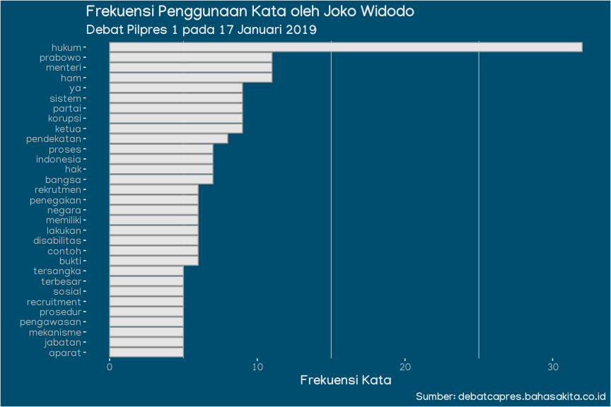
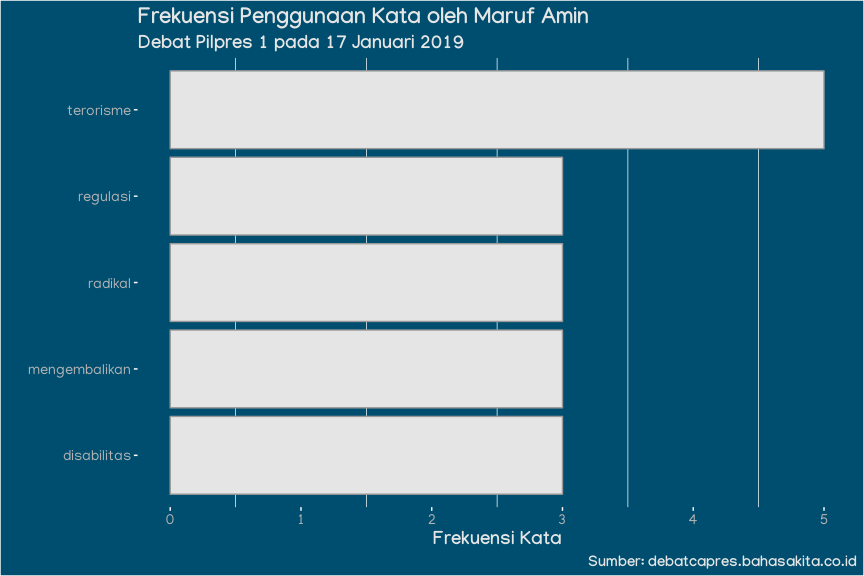
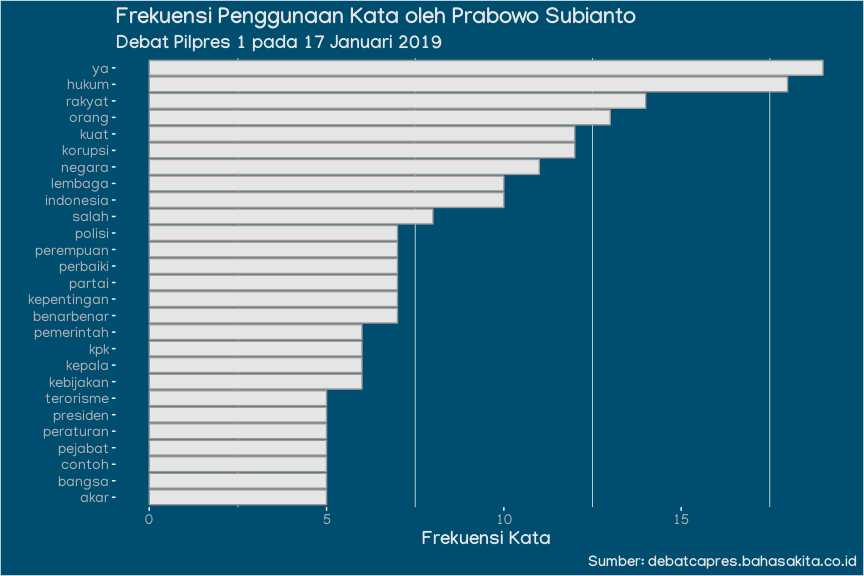
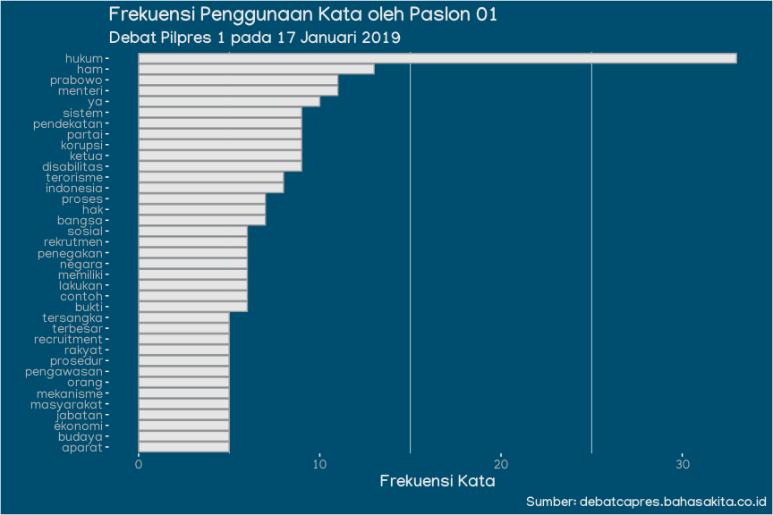
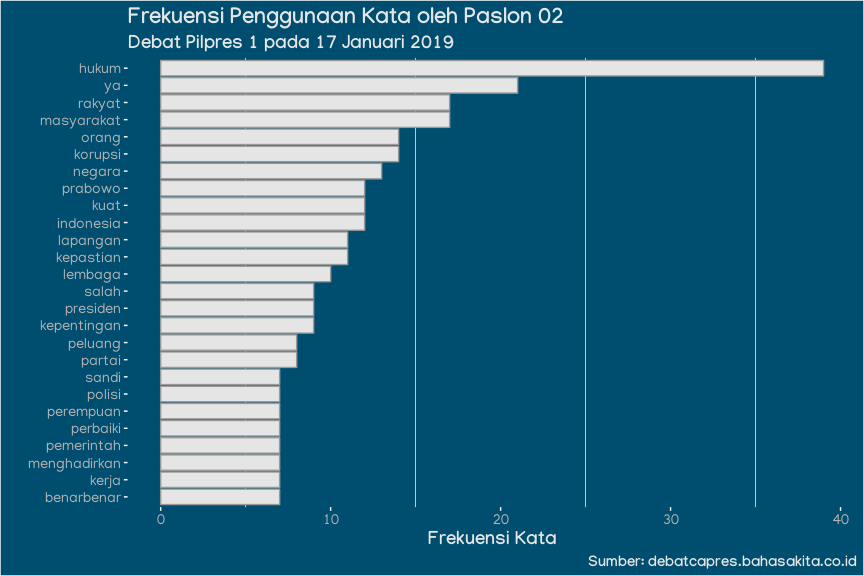
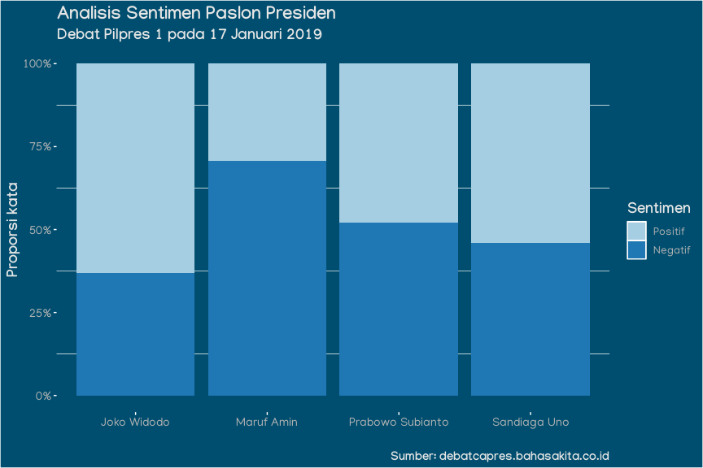

Debat Pilpres 1 2019
================
aswansyahputra
4/4/2019

## Preparasi

### Paket

``` r
library(tidyverse)
library(stopwords)
```

### Dataset

``` r
load("../data/debat-pilpres1-2019.rda")
glimpse(tks_debatcapres1_2019)
```

    ## Observations: 285
    ## Variables: 3
    ## $ waktu   <chr> "20:05", "20:06", "20:08", "20:09", "20:10", "20:11", "2…
    ## $ penutur <chr> "Arief Budiman", "Arief Budiman", "Arief Budiman", "Arie…
    ## $ teks    <chr> "calon presiden dan calon wakil presiden nomor urut calo…

``` r
tks_debatcapres1_2019 %>% 
  distinct(penutur)  
```

    ## # A tibble: 8 x 1
    ##   penutur         
    ##   <chr>           
    ## 1 Arief Budiman   
    ## 2 Ira Koesno      
    ## 3 Imam Priyono    
    ## 4 Pembicara       
    ## 5 Joko Widodo     
    ## 6 Prabowo Subianto
    ## 7 Sandiaga Uno    
    ## 8 Maruf Amin

### Stopwords

``` r
stopwords_id <- stopwords(language = "id", source = "stopwords-iso")
glimpse(stopwords_id)
```

    ##  chr [1:758] "ada" "adalah" "adanya" "adapun" "agak" "agaknya" "agar" ...

## Frekuensi Kata

``` r
frekuensi_kata <- 
  tks_debatcapres1_2019 %>% 
  mutate(
    teks = str_to_lower(teks),
    teks = str_remove_all(teks, pattern = "[:punct:]")
  ) %>% 
  separate_rows(teks, sep = " ") %>% 
  filter(
    teks != "",
    !teks %in% stopwords_id
  ) %>% 
  count(penutur, teks, sort = TRUE
  ) %>% 
  group_by(penutur) %>% 
  top_n(25, wt = n) %>% 
  ungroup() %>% 
  filter(n >= 3)

frekuensi_kata
```

    ## # A tibble: 162 x 3
    ##    penutur      teks        n
    ##    <chr>        <chr>   <int>
    ##  1 Ira Koesno   paslon     76
    ##  2 Imam Priyono paslon     33
    ##  3 Joko Widodo  hukum      32
    ##  4 Ira Koesno   01         28
    ##  5 Ira Koesno   silakan    28
    ##  6 Ira Koesno   menit      23
    ##  7 Imam Priyono habis      21
    ##  8 Imam Priyono menit      21
    ##  9 Sandiaga Uno hukum      21
    ## 10 Ira Koesno   02         20
    ## # … with 152 more rows

``` r
my_theme <- function() {
   theme(
    title = element_text(
      family = "Manjari",
      face = "bold",
      size = 14,
      colour = "grey90"
    ),
    axis.text = element_text(
      family = "Manjari",
      size = 11,
      colour = "grey70"
    ),
    legend.text = element_text(
      family = "Manjari",
      size = 10,
      colour = "grey70"
    ),
    axis.ticks = element_line(colour = "white"),
    panel.grid.major = element_blank(), 
    plot.background = element_rect(
      fill = "#004e6f"
    ), 
    panel.background = element_rect(
      fill = "#004e6f"
    ),
    legend.background = element_rect(
      fill = "#004e6f"
    )
  )
}
```

``` r
plot_kata <- function(data, penutur) {
  
  if (missing(data) | missing(penutur)) {
    stop("Argumen yang Anda masukan belum lengkap.", call. = FALSE)
  }
  
  if (!penutur %in% data[["penutur"]]) {
    stop("Penutur yang Anda inginkan tidak ada di dalam daftar penutur.", call. = FALSE)
  }
  
  data %>% 
    filter(penutur == !!enquo(penutur)) %>% 
    ggplot(aes(x = fct_reorder(teks, n), y = n)) +
    geom_col(fill = "grey90", col = "grey60") +
    coord_flip() +
    labs(
      title = paste("Frekuensi Penggunaan Kata oleh", penutur),
      subtitle = "Debat Pilpres 1 pada 17 Januari 2019",
      caption = "Sumber: debatcapres.bahasakita.co.id",
      x = "",
      y = "Frekuensi Kata"
    ) +
    my_theme()
}
```

### Per Penutur

#### Joko Widodo

``` r
plot_kata(frekuensi_kata, "Joko Widodo")
```

<!-- -->

#### Maruf Amin

``` r
plot_kata(frekuensi_kata, "Maruf Amin")
```

<!-- -->

#### Prabowo Subianto

``` r
plot_kata(frekuensi_kata, "Prabowo Subianto")
```

<!-- -->

#### Sandiaga Uno

``` r
plot_kata(frekuensi_kata, "Sandiaga Uno")
```

<!-- -->

``` r
frekuensi_kata_paslon <- 
  tks_debatcapres1_2019 %>% 
  filter(!penutur %in% c("Arief Budiman", "Pembicara")) %>% 
  mutate(
    penutur = case_when(
      penutur %in% c("Joko Widodo", "Maruf Amin") ~ "Paslon 01",
      penutur %in% c("Prabowo Subianto", "Sandiaga Uno") ~ "Paslon 02",
      TRUE ~ "Moderator"
    )
  ) %>% 
  filter(penutur != "Moderator") %>% 
  mutate(
    teks = str_to_lower(teks),
    teks = str_remove_all(teks, pattern = "[:punct:]")
  ) %>% 
  separate_rows(teks, sep = " ") %>% 
  filter(
    teks != "",
    !teks %in% stopwords_id
  ) %>% 
  count(penutur, teks, sort = TRUE
  ) %>% 
  group_by(penutur) %>% 
  top_n(25, wt = n) %>% 
  ungroup() %>% 
  filter(n >= 3)

frekuensi_kata_paslon
```

    ## # A tibble: 63 x 3
    ##    penutur   teks           n
    ##    <chr>     <chr>      <int>
    ##  1 Paslon 02 hukum         39
    ##  2 Paslon 01 hukum         33
    ##  3 Paslon 02 ya            21
    ##  4 Paslon 02 masyarakat    17
    ##  5 Paslon 02 rakyat        17
    ##  6 Paslon 02 korupsi       14
    ##  7 Paslon 02 orang         14
    ##  8 Paslon 01 ham           13
    ##  9 Paslon 02 negara        13
    ## 10 Paslon 02 indonesia     12
    ## # … with 53 more rows

### Per Paslon

#### Paslon 01

``` r
plot_kata(frekuensi_kata_paslon, "Paslon 01")
```

<!-- -->

#### Paslon 02

``` r
plot_kata(frekuensi_kata_paslon, "Paslon 02")
```

<!-- -->

## Analisis Sentimen

### Leksikon Sentimen

``` r
leksikon_sentimen <- 
  bind_rows(
    read_table("https://github.com/masdevid/ID-OpinionWords/raw/master/positive.txt", col_names = "teks") %>% 
      mutate(sentimen = "Positif"),
    read_table("https://github.com/masdevid/ID-OpinionWords/raw/master/negative.txt", col_names = "teks") %>% 
      mutate(sentimen = "Negatif")
  )
leksikon_sentimen
```

    ## # A tibble: 3,584 x 2
    ##    teks           sentimen
    ##    <chr>          <chr>   
    ##  1 a+             Positif 
    ##  2 acungan jempol Positif 
    ##  3 adaptif        Positif 
    ##  4 adil           Positif 
    ##  5 afinitas       Positif 
    ##  6 afirmasi       Positif 
    ##  7 agilely        Positif 
    ##  8 agung          Positif 
    ##  9 ahli           Positif 
    ## 10 ahlinya        Positif 
    ## # … with 3,574 more rows

### Proporsi Sentimen

``` r
prop_sentimen <- 
  tks_debatcapres1_2019 %>% 
  filter(penutur %in% c("Joko Widodo", "Maruf Amin", "Prabowo Subianto", "Sandiaga Uno")) %>% 
  mutate(
    teks = str_to_lower(teks),
    teks = str_remove_all(teks, pattern = "[:punct:]")
  ) %>% 
  separate_rows(teks, sep = " ") %>% 
  filter(
    teks != "",
    !teks %in% stopwords_id
  ) %>% 
  inner_join(leksikon_sentimen) %>% 
  group_by(penutur) %>% 
  mutate(n_teks = length(teks)) %>% 
  ungroup() %>% 
  group_by(penutur, sentimen) %>% 
  summarise(n = n(),
            n_teks = unique(n_teks)) %>% 
  ungroup() %>% 
  mutate(
    sentimen = factor(sentimen, levels = c("Positif", "Negatif")),
    proporsi_sentimen = n/n_teks
  )
prop_sentimen
```

    ## # A tibble: 8 x 5
    ##   penutur          sentimen     n n_teks proporsi_sentimen
    ##   <chr>            <fct>    <int>  <int>             <dbl>
    ## 1 Joko Widodo      Negatif     63    171             0.368
    ## 2 Joko Widodo      Positif    108    171             0.632
    ## 3 Maruf Amin       Negatif     24     34             0.706
    ## 4 Maruf Amin       Positif     10     34             0.294
    ## 5 Prabowo Subianto Negatif    122    234             0.521
    ## 6 Prabowo Subianto Positif    112    234             0.479
    ## 7 Sandiaga Uno     Negatif     35     76             0.461
    ## 8 Sandiaga Uno     Positif     41     76             0.539

``` r
ggplot(prop_sentimen, aes(penutur, proporsi_sentimen, fill = sentimen)) +
  geom_col() +
  scale_y_continuous(labels = scales::percent) +
scale_fill_brewer(type = "qual", palette = "Paired") +
  labs(
    title = "Analisis Sentimen Paslon Presiden",
    subtitle = "Debat Pilpres 1 pada 17 Januari 2019",
    caption = "Sumber: debatcapres.bahasakita.co.id",
    x = "",
    y = "Proporsi kata",
    fill = "Sentimen") +
  my_theme()
```

<!-- -->
