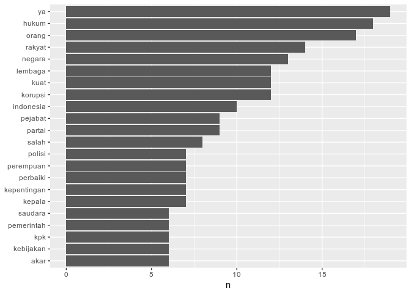
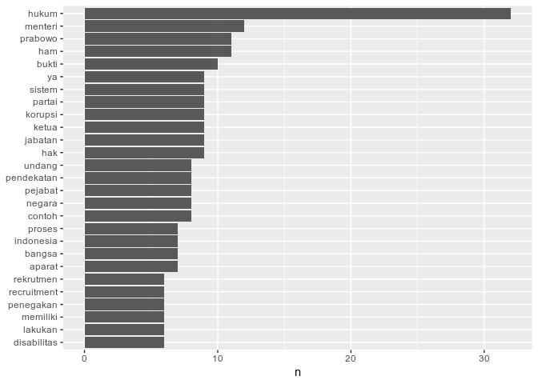
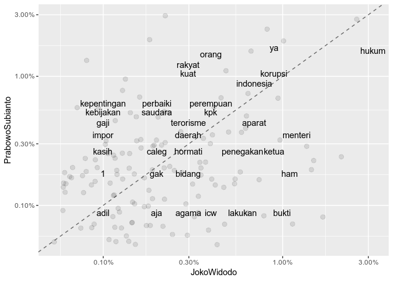

Analisis Konten Debat Pilpres Pertama
================
Sabhrina G. Aninta
31 March 2019

Untuk mendapatkan data transkripsi debat pilpres pertama, saya berusaha
mengakses data tersebut melalui package `nusandata` tapi ternyata
package ini belum ada untuk versi R saya (3.5.3). Karena itu, saya akan
menggunakan data dari file .rda yang ada dalam [repo kamis
data 003](https://github.com/indo-r/003_kamisdata_Debat-Pilpres1-2019).

``` r
library(dplyr)
```

    ## 
    ## Attaching package: 'dplyr'

    ## The following objects are masked from 'package:stats':
    ## 
    ##     filter, lag

    ## The following objects are masked from 'package:base':
    ## 
    ##     intersect, setdiff, setequal, union

``` r
# load("D:/Master/Rcourse/indo-r/003_kamisdata_Debat-Pilpres1-2019/data/debat-pilpres1-2019.rda")
load("../data/debat-pilpres1-2019.rda")
glimpse(tks_debatcapres1_2019)
```

    ## Observations: 285
    ## Variables: 3
    ## $ waktu   <chr> "20:05", "20:06", "20:08", "20:09", "20:10", "20:11", "2…
    ## $ penutur <chr> "Arief Budiman", "Arief Budiman", "Arief Budiman", "Arie…
    ## $ teks    <chr> "calon presiden dan calon wakil presiden nomor urut calo…

Hasil transkripsi ini dapat diubah ke dalam bentuk tidy text.

``` r
library(tidytext)

## membuat tidytext
prabowo <- tks_debatcapres1_2019 %>% filter(.$penutur=="Prabowo Subianto")
prabowo_df<-tibble(line=1:nrow(prabowo), teks=prabowo$teks)

jokowi <- tks_debatcapres1_2019 %>% filter(.$penutur=="Joko Widodo")
jokowi_df<-tibble(line=1:nrow(jokowi), teks=jokowi$teks)

## unnest token dalam prabowo dan jokowi
p_df<-prabowo_df %>% unnest_tokens(kata, teks)
j_df<-jokowi_df %>% unnest_tokens(kata, teks)

## melihat kata yang paling sering dikatakan
head(prabowo_df)
```

    ## # A tibble: 6 x 2
    ##    line teks                                                               
    ##   <int> <chr>                                                              
    ## 1     1 shalom om sosiastu nama budaya. Saudara saudara sekalian hadirin h…
    ## 2     2 hormati pasangan calon nomor 1 yang saya hormati dan saya banggaka…
    ## 3     3 karena itu kami dalam menghadapi masalah hukum masalah korupsi mas…
    ## 4     4 kita yakin dengan lembaga lembaga yang bersih yang kuat, kita bisa…
    ## 5     5 " Kami akan memberdayakan badan pembinaan hukum nasional kami akan…
    ## 6     6 "sinkronisasi penyelarasan sehingga undang-undang peraturan peratu…

``` r
p_df %>% count(kata, sort=T)
```

    ## # A tibble: 751 x 2
    ##    kata      n
    ##    <chr> <int>
    ##  1 kita     86
    ##  2 yang     86
    ##  3 saya     67
    ##  4 itu      51
    ##  5 dan      46
    ##  6 tidak    37
    ##  7 ini      36
    ##  8 kami     36
    ##  9 di       34
    ## 10 untuk    32
    ## # … with 741 more rows

``` r
j_df %>% count(kata, sort=T)
```

    ## # A tibble: 727 x 2
    ##    kata      n
    ##    <chr> <int>
    ##  1 yang    114
    ##  2 dan      60
    ##  3 kita     54
    ##  4 saya     53
    ##  5 ada      43
    ##  6 tidak    40
    ##  7 itu      39
    ##  8 ini      34
    ##  9 hukum    32
    ## 10 di       26
    ## # … with 717 more rows

Dari frekuensi kata tertinggi, banyak kata yang tidak memiliki makna dan
hanya merupakan kata depan atau kata penghubung. Kata-kata semacam ini
dalam bahasa Inggris disebut “*stopwords*” dan daftar kata semacam ini
sudah banyak dalam bahasa Inggris. Package ini tidak memuat daftar
*stopwords* dalam bahasa Indonesia sehingga perlu kita tetapkan sendiri.
Untungnya, sudah ada yang membuat daftar *stopwords* dalam bahasa
Indonesia di GitHub.

``` r
library(tidyverse)
```

    ## Registered S3 methods overwritten by 'ggplot2':
    ##   method         from 
    ##   [.quosures     rlang
    ##   c.quosures     rlang
    ##   print.quosures rlang

    ## Registered S3 method overwritten by 'rvest':
    ##   method            from
    ##   read_xml.response xml2

    ## ── Attaching packages ─────────────────────────────── tidyverse 1.2.1 ──

    ## ✔ ggplot2 3.1.1     ✔ readr   1.3.1
    ## ✔ tibble  2.1.1     ✔ purrr   0.3.2
    ## ✔ tidyr   0.8.3     ✔ stringr 1.4.0
    ## ✔ ggplot2 3.1.1     ✔ forcats 0.4.0

    ## ── Conflicts ────────────────────────────────── tidyverse_conflicts() ──
    ## ✖ dplyr::filter() masks stats::filter()
    ## ✖ dplyr::lag()    masks stats::lag()

``` r
stopwords_indo <- read_csv("https://raw.githubusercontent.com/masdevid/ID-Stopwords/master/id.stopwords.02.01.2016.txt", col_names = "stopword")
```

    ## Parsed with column specification:
    ## cols(
    ##   stopword = col_character()
    ## )

``` r
p_df_tidy <- p_df %>% anti_join(y=stopwords_indo,by=c("kata"="stopword"))
p_df_tidy %>% count(kata, sort=T) %>% filter(n > 5) %>%
  mutate(kata = reorder(kata, n)) %>%
  ggplot(aes(kata, n)) +
  geom_col() +
  xlab(NULL) +
  coord_flip()
```

<!-- -->

``` r
j_df_tidy <- j_df %>% anti_join(y=stopwords_indo,by=c("kata"="stopword"))
j_df_tidy %>% count(kata, sort=T) %>% filter(n > 5) %>%
  mutate(kata = reorder(kata, n)) %>%
  ggplot(aes(kata, n)) +
  geom_col() +
  xlab(NULL) +
  coord_flip()
```

<!-- -->

Karena bahasa lisan, ada stopword yang tidak sesuai dengan bahasa tulis
semisal “ya”. Akan lebih menarik jika kedua calon presiden dianalisis
secara bersamaan untuk melihat korelasi kecenderungan penggunaan kata.

``` r
## menggabungkan kedua calon presiden
p.j<-bind_rows(mutate(p_df_tidy, penutur="PrabowoSubianto"),
               mutate(j_df_tidy, penutur="JokoWidodo")) %>%  count(penutur, kata) %>% group_by(penutur) %>%  mutate(proporsi = n / sum(n)) %>% select(-n) %>% spread(penutur,proporsi)

p.j
```

    ## # A tibble: 931 x 3
    ##    kata  JokoWidodo PrabowoSubianto
    ##    <chr>      <dbl>           <dbl>
    ##  1 01     NA               0.000985
    ##  2 1       0.000993        0.00197 
    ##  3 10     NA               0.00197 
    ##  4 16     NA               0.000985
    ##  5 2       0.000993       NA       
    ##  6 200    NA               0.000985
    ##  7 2016    0.000993       NA       
    ##  8 2018    0.000993       NA       
    ##  9 250     0.000993       NA       
    ## 10 30     NA               0.00296 
    ## # … with 921 more rows

``` r
library(scales)
```

    ## 
    ## Attaching package: 'scales'

    ## The following object is masked from 'package:purrr':
    ## 
    ##     discard

    ## The following object is masked from 'package:readr':
    ## 
    ##     col_factor

``` r
p.j %>% filter(complete.cases(.)) %>% ggplot(aes(x=JokoWidodo,y=PrabowoSubianto)) +
  geom_abline(color = "gray40", lty = 2) +
  geom_jitter(alpha = 0.1, size = 2.5, width = 0.3, height = 0.3) +
  geom_text(aes(label = kata), check_overlap = TRUE, vjust = 1.5) +
  scale_x_log10(labels = percent_format()) +
  scale_y_log10(labels = percent_format()) +
  scale_color_gradient(low = "darkslategray4", high = "gray75") +
  theme(legend.position="none")
```

<!-- -->

Kata yang dekat dengan garis putus-putus menunjukkan kata yang memiliki
frekuensi sama dituturkan oleh kedua belah pihak.

``` r
cor.test(p.j$PrabowoSubianto,p.j$JokoWidodo)
```

    ## 
    ##  Pearson's product-moment correlation
    ## 
    ## data:  p.j$PrabowoSubianto and p.j$JokoWidodo
    ## t = 6.5716, df = 131, p-value = 1.073e-09
    ## alternative hypothesis: true correlation is not equal to 0
    ## 95 percent confidence interval:
    ##  0.3580481 0.6159456
    ## sample estimates:
    ##       cor 
    ## 0.4979266

*Analisis ini mengikuti contoh dari chapter pertama [“Text Mining with
R”](https://www.tidytextmining.com)*
