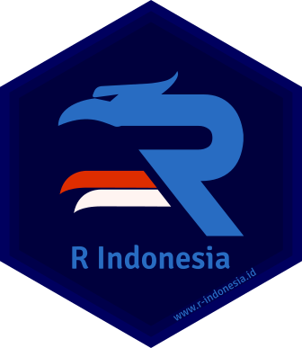

# Kamis Data 

<!-- badges: start -->

<!-- badges: end -->

Program pekanan Kamis Data dari [**Komunitas R Indonesia**.](https://GNURIndonesia)

## Topik dan Data Tersedia

* Kamis Data 001 - Persentase Penduduk Perkotaan
* Kamis Data 002 - Caleg DPR RI 2019
* Kamis Data 003 - Debat Pilpres Pertama 2019
* Kamis Data 004 - Paket Lelang Kota Bandung
* Kamis Data 005 - Perkara Pidana Umum Kejari RI
* Kamis Data 006 - Indonesia Database for Policy and Economic Research
* Kamis Data 007 - Karakter Dalam Marvel Cinematic Universe
* Kamis Data 008 - Akun Instagram Tirto
* Kamis Data 009 - Film Indonesia Teratas 2007 - 2019
* Kamis Data 010 - Film Indonesia Sejak 1926
* Kamis Data 011 - Lagu Teratas di Spotify Indonesia 2018
* Kamis Data 012 - Buku Indonesia Sepanjang Masa

## Cara Berpartisipasi

1. Silakan *Fork* repositori ini
2. Pilih topik yang Anda inginkan untuk dieksplorasi dan dianalisis
3. Buat berkas R Markdown baru dalam direktori 'vignettes' dengan format **"kode-nama-judul_analisis.Rmd"** untuk menuliskan pekerjaan Anda. Contoh: "002-sabhrina-eksplorasi_caleg_2019.Rmd"
4. Skrip untuk mendapatkan data tersedia dalam direktori 'data-raw'. Anda dapat menggunakan skrip tersebut atau langsung menggunakan data berekstensi `rda` dalam direktori 'data'. **Jangan mengubah nama berkas dalam folder data-raw!**
5. Harap untuk mempergunakan *ouput document* berupa GitHub Document. Pada YAML *header* R Markdown silakan untuk menuliskan **`output: github_document`**. Namun jika R Markdown tersebut tidak dapat di *render* menjadi dokumen markdown, harap untuk menambahkan opsi **`keep_md: true`** pada YAML *header*
6. Jangan lupa untuk melakukan **_knitting_** pada berkas R Markdown hasil pekerjaan Anda tersebut!
7. Pada hari rabu pekan berikutnya, silakan mengajukan **_Pull request_** atas hasil kerja Anda. Selamat mencoba!

**Catatan:** Jika Anda sebelumnya telah melakukan *forking*, silakan ikuti panduan pada pranala [ini](https://digitaldrummerj.me/git-sync-fork-to-master/) untuk melakukan sinkronisasi repositori

## Menggunakan Binder
Anda dapat melakukan analisis data atau mempelajari skrip analisis data yang telah dibuat langsung dari peramban dengan menggunakan *binder*. Anda tidak perlu mengunduh/klon repositori ini atau memasang RStudio terlebih dahulu untuk menjalankan *binder*, cukup klik >> !

## Kontribusi
Anda memiliki dataset yang menarik? Silakan kontak [Muhammad Aswan Syahputra](https://t.me/aswansyahputra) jika Anda ingin menyumbangkan data tersebut untuk program Kamis Data selanjutnya!

## Lisensi

 Program Kamis Data ini memiliki lisensi
<a rel="license" href="http://creativecommons.org/licenses/by-sa/4.0/">Atribusi-BerbagiSerupa 4.0 Internasional (CC BY-SA 4.0)</a>.

**Anda diperbolehkan:**

+ **Berbagi** — menyalin dan menyebarluaskan kembali materi ini dalam bentuk atau format apapun;
+ **Adaptasi** — menggubah, mengubah, dan membuat turunan dari materi ini untuk kepentingan apapun, termasuk kepentingan komersial. 

**Berdasarkan ketentuan berikut:**

+ **Atribusi** — Anda harus mencantumkan nama yang sesuai, mencantumkan tautan terhadap lisensi, dan menyatakan bahwa telah ada perubahan yang dilakukan. Anda dapat melakukan hal ini dengan cara yang sesuai, namun tidak mengisyaratkan bahwa pemberi lisensi mendukung Anda atau penggunaan Anda.
+ **BerbagiSerupa** — Apabila Anda menggubah, mengubah, atau membuat turunan dari materi ini, Anda harus menyebarluaskan kontribusi Anda di bawah lisensi yang sama dengan materi asli. 
    
