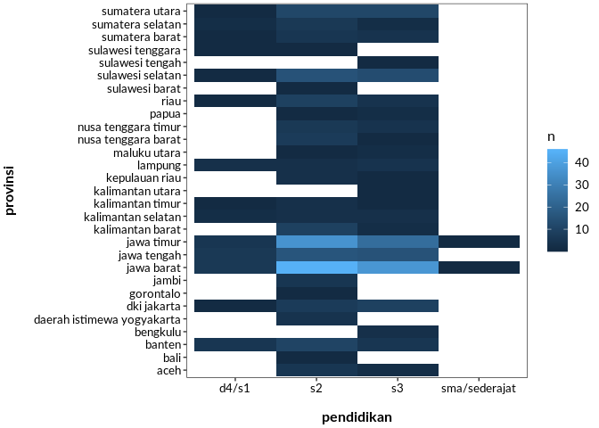
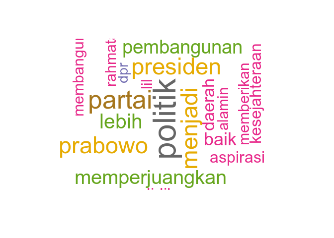

Eksplorasi Data Caleg DPR 2019
================
Sabhrina G. Aninta
28 March 2019

#### Baca Data Caleg 2019

Blok kode berikut adalah kode yang digunakan untuk membaca data dari
repositori indo-r. Ada fungsi menarik yang berbeda dari base R yakni
`readr::read_delim` yang lebih efisien daripada `utils::read.delim`yang
sudah ada di R dasar dan fungsi `janitor::clean_names()` yang
membersihkan judul kolom dengan sangat cepat. Buat yang belum tahu
`janitor` kayak saya, biasanya bersihin colnames pake `base::gsub` dan
kawan-kawan
`grep`nya.

``` r
# download.file("https://raw.githubusercontent.com/seuriously/caleg_dpr_2019/master/caleg_dpr.csv", destfile = "input/caleg_dpr_2019.csv") # saya membuat folder input untuk semua data masuk yang akan diproses untuk memisahkan yang raw dengan yang sudah ditransformasi 

# caleg<-read_delim("input/caleg_dpr_2019.csv", delim = "|", na = c("", "NA", "-"))
caleg <- read_delim("https://raw.githubusercontent.com/seuriously/caleg_dpr_2019/master/caleg_dpr.csv", delim = "|", na = c("", "NA", "-"))
glimpse(caleg)
```

    ## Observations: 7,634
    ## Variables: 25
    ## $ kota_tinggal                   <chr> "kota banda aceh", "jakarta barat…
    ## $ id                             <dbl> 21661, 163535, 44210, 160180, 179…
    ## $ stringJenisKelamin             <chr> "laki-laki", "laki-laki", "peremp…
    ## $ partai                         <chr> "berkarya", "berkarya", "berkarya…
    ## $ Dapil                          <chr> "aceh i", "aceh i", "aceh i", "ac…
    ## $ provinsi                       <chr> "aceh", "aceh", "aceh", "aceh", "…
    ## $ No..Urut                       <dbl> 1, 2, 3, 4, 5, 6, 7, 1, 2, 3, 4, …
    ## $ Nomor.Induk.Kependudukan..NIK. <chr> "110501230773****", "317308151057…
    ## $ Gelar.Akademis.Depan           <chr> NA, "dr. ir", NA, NA, NA, NA, NA,…
    ## $ Gelar.Akademis.Belakang        <chr> "sp., msi.", "sh, mm", "sh", "se"…
    ## $ Nama.Lengkap                   <chr> "nurchalis", "jamil ansari", "ira…
    ## $ Tempat.Lahir                   <chr> "aceh jaya", "sabang", "semarang"…
    ## $ Tanggal.Lahir                  <chr> "23-07-1973", "15-10-1957", "20-1…
    ## $ Jenis.Kelamin                  <chr> "laki-laki", "laki-laki", "peremp…
    ## $ Agama                          <chr> "islam", "islam", "islam", "islam…
    ## $ Status.Perkawinan              <chr> "sudah menikah", "sudah menikah",…
    ## $ Nama.Suami.Istri               <chr> "reni yuniar, skm", "zumairi hemi…
    ## $ Jumlah.Anak                    <dbl> 2, 2, 6, 6, 0, 3, 3, 1, 3, NA, 5,…
    ## $ Alamat                         <chr> "tm asyek lr ii no 37", "jl. mera…
    ## $ Pendidikan                     <chr> "s2", "s3", "d4/s1", "d4/s1", "sm…
    ## $ Pekerjaan                      <chr> "swasta", "pensiunan pns", "swast…
    ## $ Status.Khusus                  <chr> "tidak ada", "tidak ada", "tidak …
    ## $ Motivasi                       <chr> "untuk mengabdi kepada bangsa dan…
    ## $ Target.Sasaran                 <chr> "terpilih menjadi anggota legisla…
    ## $ umur                           <dbl> 46, 62, 56, 53, 58, 66, 59, 61, 6…

``` r
caleg<-caleg %>%  select(
    partai,
    provinsi,
    Dapil,
    No..Urut,
    Nama.Lengkap,
    Jenis.Kelamin,
    Gelar.Akademis.Depan,
    Gelar.Akademis.Belakang,
    Pendidikan,
    Pekerjaan,
    kota_tinggal,
    Tempat.Lahir,
    Tanggal.Lahir,
    umur,
    Agama,
    Status.Perkawinan,
    Jumlah.Anak,
    Motivasi,
    Status.Khusus
  ) %>%
  clean_names()
```

Dari hasil pembersihan data, tampak bahwa sebagian besar variabel
berjenis string sehingga saya memfaktorkan beberapa variabel yang
tampaknya menarik dianalisis sebagai faktor.

``` r
glimpse(caleg)
```

    ## Observations: 7,634
    ## Variables: 19
    ## $ partai                  <chr> "berkarya", "berkarya", "berkarya", "ber…
    ## $ provinsi                <chr> "aceh", "aceh", "aceh", "aceh", "aceh", …
    ## $ dapil                   <chr> "aceh i", "aceh i", "aceh i", "aceh i", …
    ## $ no_urut                 <dbl> 1, 2, 3, 4, 5, 6, 7, 1, 2, 3, 4, 5, 6, 1…
    ## $ nama_lengkap            <chr> "nurchalis", "jamil ansari", "ira hadiat…
    ## $ jenis_kelamin           <chr> "laki-laki", "laki-laki", "perempuan", "…
    ## $ gelar_akademis_depan    <chr> NA, "dr. ir", NA, NA, NA, NA, NA, "drs",…
    ## $ gelar_akademis_belakang <chr> "sp., msi.", "sh, mm", "sh", "se", NA, N…
    ## $ pendidikan              <chr> "s2", "s3", "d4/s1", "d4/s1", "sma/seder…
    ## $ pekerjaan               <chr> "swasta", "pensiunan pns", "swasta", "sw…
    ## $ kota_tinggal            <chr> "kota banda aceh", "jakarta barat", "jak…
    ## $ tempat_lahir            <chr> "aceh jaya", "sabang", "semarang", "bire…
    ## $ tanggal_lahir           <chr> "23-07-1973", "15-10-1957", "20-10-1963"…
    ## $ umur                    <dbl> 46, 62, 56, 53, 58, 66, 59, 61, 64, 34, …
    ## $ agama                   <chr> "islam", "islam", "islam", "islam", "isl…
    ## $ status_perkawinan       <chr> "sudah menikah", "sudah menikah", "sudah…
    ## $ jumlah_anak             <dbl> 2, 2, 6, 6, 0, 3, 3, 1, 3, NA, 5, 3, 4, …
    ## $ motivasi                <chr> "untuk mengabdi kepada bangsa dan negara…
    ## $ status_khusus           <chr> "tidak ada", "tidak ada", "tidak ada", "…

``` r
## biar asik ada beberapa variabel yang difaktorkan
caleg_2019<-caleg %>% mutate(partai=as.factor(partai),
                                  provinsi=as.factor(provinsi),
                                  dapil=as.factor(provinsi),
                                  jenis_kelamin=as.factor(jenis_kelamin),
                                  gelar_akademis_depan=as.factor(gelar_akademis_depan),
                                gelar_akademis_belakang=as.factor(gelar_akademis_belakang),
                                  pendidikan=as.factor(pendidikan),
                                  pekerjaan=as.factor(pekerjaan),
                                  kota_tinggal=as.factor(kota_tinggal),
                                  tempat_lahir=as.factor(tempat_lahir),
                                  tanggal_lahir=as.Date(tanggal_lahir),
                                  agama=as.factor(agama),
                                  status_perkawinan=as.factor(status_perkawinan),
                                  jumlah_anak=as.factor(jumlah_anak))

glimpse(caleg_2019)
```

    ## Observations: 7,634
    ## Variables: 19
    ## $ partai                  <fct> berkarya, berkarya, berkarya, berkarya, …
    ## $ provinsi                <fct> aceh, aceh, aceh, aceh, aceh, aceh, aceh…
    ## $ dapil                   <fct> aceh, aceh, aceh, aceh, aceh, aceh, aceh…
    ## $ no_urut                 <dbl> 1, 2, 3, 4, 5, 6, 7, 1, 2, 3, 4, 5, 6, 1…
    ## $ nama_lengkap            <chr> "nurchalis", "jamil ansari", "ira hadiat…
    ## $ jenis_kelamin           <fct> laki-laki, laki-laki, perempuan, laki-la…
    ## $ gelar_akademis_depan    <fct> NA, dr. ir, NA, NA, NA, NA, NA, drs, drs…
    ## $ gelar_akademis_belakang <fct> "sp., msi.", "sh, mm", "sh", "se", NA, N…
    ## $ pendidikan              <fct> s2, s3, d4/s1, d4/s1, sma/sederajat, d1,…
    ## $ pekerjaan               <fct> swasta, pensiunan pns, swasta, swasta, i…
    ## $ kota_tinggal            <fct> kota banda aceh, jakarta barat, jakarta …
    ## $ tempat_lahir            <fct> aceh jaya, sabang, semarang, bireuen, me…
    ## $ tanggal_lahir           <date> 23-07-19, 15-10-19, 20-10-19, 6-06-19, …
    ## $ umur                    <dbl> 46, 62, 56, 53, 58, 66, 59, 61, 64, 34, …
    ## $ agama                   <fct> islam, islam, islam, islam, islam, islam…
    ## $ status_perkawinan       <fct> sudah menikah, sudah menikah, sudah meni…
    ## $ jumlah_anak             <fct> 2, 2, 6, 6, 0, 3, 3, 1, 3, NA, 5, 3, 4, …
    ## $ motivasi                <chr> "untuk mengabdi kepada bangsa dan negara…
    ## $ status_khusus           <chr> "tidak ada", "tidak ada", "tidak ada", "…

#### Cek Data

Yang selalu saya lakukan sebelum memulai eksplorasi dan analisis data
adalah melihat apakah dalam data ada duplikat. Hal ini saya lakukan
dengan melihat jumlah baris menggunakan `nrow()` dan membandingkannya
dengan jumlah baris yang unik menggunakan `distinct()`

``` r
## Lihat jumlah caleg secara umum
caleg_2019 %>% distinct() %>% summarise(n=n())
```

    ## # A tibble: 1 x 1
    ##       n
    ##   <int>
    ## 1  6759

``` r
## Berapakah jumlah entri duplikat jika ada?
nrow(caleg_2019)-caleg_2019 %>% distinct() %>% summarise(n=n())
```

    ##     n
    ## 1 875

``` r
## Bagaimanakah tampilan data duplikat?
head(caleg_2019[duplicated(caleg_2019)==T,])
```

    ## # A tibble: 6 x 19
    ##   partai provinsi dapil no_urut nama_lengkap jenis_kelamin gelar_akademis_…
    ##   <fct>  <fct>    <fct>   <dbl> <chr>        <fct>         <fct>           
    ## 1 demok… aceh     aceh       NA <NA>         <NA>          <NA>            
    ## 2 demok… aceh     aceh       NA <NA>         <NA>          <NA>            
    ## 3 demok… aceh     aceh       NA <NA>         <NA>          <NA>            
    ## 4 demok… aceh     aceh       NA <NA>         <NA>          <NA>            
    ## 5 demok… aceh     aceh       NA <NA>         <NA>          <NA>            
    ## 6 demok… aceh     aceh       NA <NA>         <NA>          <NA>            
    ## # … with 12 more variables: gelar_akademis_belakang <fct>,
    ## #   pendidikan <fct>, pekerjaan <fct>, kota_tinggal <fct>,
    ## #   tempat_lahir <fct>, tanggal_lahir <date>, umur <dbl>, agama <fct>,
    ## #   status_perkawinan <fct>, jumlah_anak <fct>, motivasi <chr>,
    ## #   status_khusus <chr>

``` r
## Entri keberapakah yang duplikat?
which(duplicated(caleg_2019))
```

    ##  [1] 557 558 560 562 565 566 570 573 576 577 579 581 585 587 588 589 591
    ## [18] 592 597 598 599 604 605 608 610 611 612 613 616 617 619 621 625 626
    ## [35] 627 629 630 636 639 641 642 643 652 653 654 655 658 659 660 661
    ##  [ reached getOption("max.print") -- omitted 825 entries ]

``` r
## Lokasi duplikat cukup tersebar, mari lihat salah satu bagian
caleg_2019[559:571,]
```

    ## # A tibble: 13 x 19
    ##    partai provinsi dapil no_urut nama_lengkap jenis_kelamin
    ##    <fct>  <fct>    <fct>   <dbl> <chr>        <fct>        
    ##  1 demok… aceh     aceh       NA <NA>         <NA>         
    ##  2 demok… aceh     aceh       NA <NA>         <NA>         
    ##  3 demok… aceh     aceh        7 rahmiati     perempuan    
    ##  4 demok… aceh     aceh       NA <NA>         <NA>         
    ##  5 demok… aceh     aceh       NA <NA>         <NA>         
    ##  6 demok… aceh     aceh       NA <NA>         <NA>         
    ##  7 demok… aceh     aceh       NA <NA>         <NA>         
    ##  8 demok… aceh     aceh       NA <NA>         <NA>         
    ##  9 demok… aceh     aceh       NA <NA>         <NA>         
    ## 10 demok… sumater… suma…      NA <NA>         <NA>         
    ## 11 demok… sumater… suma…      NA <NA>         <NA>         
    ## 12 demok… sumater… suma…      NA <NA>         <NA>         
    ## 13 demok… sumater… suma…      NA <NA>         <NA>         
    ## # … with 13 more variables: gelar_akademis_depan <fct>,
    ## #   gelar_akademis_belakang <fct>, pendidikan <fct>, pekerjaan <fct>,
    ## #   kota_tinggal <fct>, tempat_lahir <fct>, tanggal_lahir <date>,
    ## #   umur <dbl>, agama <fct>, status_perkawinan <fct>, jumlah_anak <fct>,
    ## #   motivasi <chr>, status_khusus <chr>

Dari hasil cek duplikat, ternyata hanya ada 6759 baris data yang unik
dari 7634 total baris dalam set data. Entri duplikat ini sebagian besar
adalah data yang ada nama partai, provinsi, dan kota tempat tinggal tapi
tidak ada nomor urut dan nama. Mungkinkah ada kesalahan dalam pembacaan
url? Saya sudah masukkan isu ini ke [github penyedia
data](https://github.com/seuriously/caleg_dpr_2019/issues/2).

Untuk membuat analisis lebih baik, semua baris yang mengandung NA dan
duplikat saya hilangkan

``` r
caleg2019_clean<-caleg_2019[complete.cases(caleg_2019),]
dim(caleg2019_clean)
```

    ## [1] 403  19

Hanya 403 caleg yang memberikan informasi lengkap\! Sebagian besar
partai memiliki di bawah 20% calegnya mengisi form dengan lengkap, namun
perlu diperhatikan bahwa ini masih tergantung kepada seberapa bersih
data dibaca dari website KPU; **siapa tahu ada kesalahan dalam pembacaan
data**

``` r
## Mau lihat dari partai mana caleg2 serius ini
calegSerius<-caleg2019_clean %>% group_by(partai) %>% summarise(n=n())
calegSemua<-caleg_2019 %>% group_by(partai) %>% summarise(n=n())
calegSeriusPerSemua<-left_join(calegSerius,calegSemua,by="partai")
calegSeriusPerSemua %>% mutate(persentase=(n.x/n.y)*100)
```

    ## # A tibble: 12 x 4
    ##    partai     n.x   n.y persentase
    ##    <fct>    <int> <int>      <dbl>
    ##  1 berkarya    35   554      6.32 
    ##  2 demokrat     2   574      0.348
    ##  3 garuda       1   227      0.441
    ##  4 gerindra    55   575      9.57 
    ##  5 golkar      40   300     13.3  
    ##  6 nasdem      24   575      4.17 
    ##  7 pan         34   498      6.83 
    ##  8 perindo     45   568      7.92 
    ##  9 pkb         50   575      8.70 
    ## 10 pks         61   533     11.4  
    ## 11 ppp         36   557      6.46 
    ## 12 psi         20   575      3.48

``` r
## Mau lihat dari nomor urut mana
caleg2019_clean %>% group_by(no_urut) %>% count(partai)
```

    ## # A tibble: 86 x 3
    ## # Groups:   no_urut [10]
    ##    no_urut partai       n
    ##      <dbl> <fct>    <int>
    ##  1       1 berkarya     6
    ##  2       1 demokrat     1
    ##  3       1 garuda       1
    ##  4       1 gerindra    11
    ##  5       1 golkar      11
    ##  6       1 nasdem       3
    ##  7       1 pan          3
    ##  8       1 perindo      8
    ##  9       1 pkb         12
    ## 10       1 pks         23
    ## # … with 76 more rows

#### Eksplorasi Data: Seberapa “Terdidik” Caleg Kita?

Yang mungkin menarik untuk dilihat adalah bagaimana distribusi tingkat
pendidikan. Gelar akademis membutuhkan pengulikan tersendiri karena
penulisan gelar tidak standar (ternyata masih banyak caleg kita yang
belum paham ejaan yang disempurnakan).

``` r
## Lihat caleg berdasarkan pendidikan
caleg2019_clean %>% group_by(pendidikan) %>% summarise(n=n())
```

    ## # A tibble: 4 x 2
    ##   pendidikan        n
    ##   <fct>         <int>
    ## 1 d4/s1            36
    ## 2 s2              214
    ## 3 s3              151
    ## 4 sma/sederajat     2

``` r
caleg2019_clean %>% group_by(gelar_akademis_depan) %>% summarise(n=n())
```

    ## # A tibble: 39 x 2
    ##    gelar_akademis_depan     n
    ##    <fct>                <int>
    ##  1 capt                     1
    ##  2 capt.drs                 1
    ##  3 dipl. ing                2
    ##  4 dr                     125
    ##  5 dr drg                   1
    ##  6 dr ir                    2
    ##  7 dr,hj                    1
    ##  8 dr.                      2
    ##  9 dr. dr                   1
    ## 10 dr. dra                  1
    ## # … with 29 more rows

``` r
caleg2019_clean %>% group_by(gelar_akademis_belakang) %>% summarise(n=n())
```

    ## # A tibble: 208 x 2
    ##    gelar_akademis_belakang            n
    ##    <fct>                          <int>
    ##  1 ,se                                1
    ##  2 a. mt                              1
    ##  3 a.md., s.e., s.h., m.h., m.mar     1
    ##  4 ak                                 1
    ##  5 apt                                3
    ##  6 apt, mp                            1
    ##  7 apt.,mm                            1
    ##  8 asc&t ,spkfr,mkes-mmr              1
    ##  9 b.ac                               1
    ## 10 b.eng., m.eng.                     1
    ## # … with 198 more rows

``` r
## ternyata untuk gelar_akademis_depan termasuk gelar nonakademik sehingga harus dibersihkan

## Coba lihat siapa saja yang tidak isi kolom pendidikannya
caleg2019_clean %>% group_by(pendidikan) %>% count(gelar_akademis_belakang)
```

    ## # A tibble: 240 x 3
    ## # Groups:   pendidikan [4]
    ##    pendidikan gelar_akademis_belakang     n
    ##    <fct>      <fct>                   <int>
    ##  1 d4/s1      ,se                         1
    ##  2 d4/s1      ak                          1
    ##  3 d4/s1      apt                         1
    ##  4 d4/s1      b.ac                        1
    ##  5 d4/s1      bsc                         1
    ##  6 d4/s1      m.ak.                       1
    ##  7 d4/s1      m.m                         1
    ##  8 d4/s1      mars                        1
    ##  9 d4/s1      mh                          1
    ## 10 d4/s1      mha., fs.                   1
    ## # … with 230 more rows

Karena itu, saya mau melihat korelasi antara provinsi asal dengan
pendidikan, serta jumlah caleg terbanyak di mana.

``` r
# baru bikin grafik
caleg2019_clean %>% count(pendidikan,provinsi) %>% ggplot() +
  geom_tile(aes(y=provinsi, x=pendidikan, fill=n)) +
  theme_caleg +
  theme(plot.margin = margin(.1,.1,.1,.1, "cm"))
```

<!-- -->

Ternyata caleg terbanyak adalah caleg Jawa Barat dan Jawa Timur
berpendidikan S2, sisanya tersebar cukup rata. Sebagian besar caleg
adalah S1 dan S2, sementara caleg yang berpendidikan lebih rendah dari
D4/S1 hanya ada dari Jawa: apakah ini masalah kepedean atau kesempatan?

#### Motivasi Para Caleg

Nah, sebagian besar caleg kita kan berpendidikan tinggi nih, mau tahu
dong yang menjadi motivasi para caleg kita apa. Kata yang paling banyak
digunakan dalam menulis motivasi dapat ditampilkan dalam awan kata.

``` r
library(tm)
library(SnowballC)
library(wordcloud)
library(RColorBrewer)

# Buat file katanya
calegMotivasi<-caleg2019_clean %>% select(motivasi)
calegMotivasi<-Corpus(VectorSource(calegMotivasi))
# inspect(calegMotivasi) (untuk melihat keseluruhan teks yang diubah menjadi corpus)

# membersihkan korpus
toSpace <- content_transformer(function (x , pattern ) gsub(pattern, " ", x))
calegMotivasi <- tm_map(calegMotivasi, toSpace, "/")
```

    ## Warning in tm_map.SimpleCorpus(calegMotivasi, toSpace, "/"): transformation
    ## drops documents

``` r
calegMotivasi <- tm_map(calegMotivasi, toSpace, "@")
```

    ## Warning in tm_map.SimpleCorpus(calegMotivasi, toSpace, "@"): transformation
    ## drops documents

``` r
calegMotivasi <- tm_map(calegMotivasi, toSpace, "\\|")
```

    ## Warning in tm_map.SimpleCorpus(calegMotivasi, toSpace, "\\|"):
    ## transformation drops documents

``` r
# mengubah teks ke lower case
calegMotivasi <- tm_map(calegMotivasi, content_transformer(tolower))
```

    ## Warning in tm_map.SimpleCorpus(calegMotivasi,
    ## content_transformer(tolower)): transformation drops documents

``` r
# menghilangkan angka
calegMotivasi <- tm_map(calegMotivasi, removeNumbers)
```

    ## Warning in tm_map.SimpleCorpus(calegMotivasi, removeNumbers):
    ## transformation drops documents

``` r
# menghilangkan kata-kata yang terlalu umum
calegMotivasi <- tm_map(calegMotivasi, removeWords, c("di", "ke", "dari", "dan", "karena", "maka", "untuk","yang", "ada", "agar", "supaya", "ini", "itu", "pada", "turut", "ikut", "ingin", "dalam", "melalui", "sebagai", "dengan", "bagi", "saya", "kepada", "serta"))
```

    ## Warning in tm_map.SimpleCorpus(calegMotivasi, removeWords, c("di", "ke", :
    ## transformation drops documents

``` r
# menghilangkan tanda baca
calegMotivasi <- tm_map(calegMotivasi, removePunctuation)
```

    ## Warning in tm_map.SimpleCorpus(calegMotivasi, removePunctuation):
    ## transformation drops documents

``` r
# menghilangkan ruang spasi ekstra
calegMotivasi <- tm_map(calegMotivasi, stripWhitespace)
```

    ## Warning in tm_map.SimpleCorpus(calegMotivasi, stripWhitespace):
    ## transformation drops documents

``` r
# Text stemming
calegMotivasi <- tm_map(calegMotivasi, stemDocument)
```

    ## Warning in tm_map.SimpleCorpus(calegMotivasi, stemDocument): transformation
    ## drops documents

``` r
## Membuat matriks istilah
motivasi <- TermDocumentMatrix(calegMotivasi)
m <- as.matrix(motivasi)
v <- sort(rowSums(m),decreasing=TRUE)
d <- data.frame(word = names(v),freq=v)
head(d, 10)
```

    ##                  word freq
    ## indonesia   indonesia  102
    ## bangsa         bangsa   93
    ## masyarakat masyarakat   92
    ## negara         negara   87
    ## rakyat         rakyat   87
    ## politik       politik   68
    ## partai         partai   53
    ## menjadi       menjadi   48
    ## presiden     presiden   48
    ## prabowo       prabowo   47

``` r
## Buat awan kata
set.seed(1234)
wordcloud(words = d$word, freq = d$freq, min.freq = 30,
          max.words=200, random.order=FALSE, rot.per=0.35, 
          colors=brewer.pal(8, "Dark2"))
```

<!-- -->

``` r
## tentu saja indonesia banyak dikatakan, apalagi masyarakat dan rakyat karena mereka mendulang suara. bagaimana jika kata2 yang terlalu umum dalam data set dihilangkan?
calegMotivasi <- tm_map(calegMotivasi, removeWords, c("indonesia","masyarakat","rakyat", "negara","bangsa"))
```

    ## Warning in tm_map.SimpleCorpus(calegMotivasi, removeWords, c("indonesia", :
    ## transformation drops documents

``` r
motivasi2 <- TermDocumentMatrix(calegMotivasi)
m2 <- as.matrix(motivasi2)
v2 <- sort(rowSums(m2),decreasing=TRUE)
d2 <- data.frame(word = names(v2),freq=v2)

wordcloud(words = d2$word, freq = d2$freq, min.freq = 25,
          max.words=200, random.order=FALSE, rot.per=0.6, 
          colors=brewer.pal(8, "Dark2"))
```

<!-- -->

Kata yang paling banyak muncul setelah kata “indonesia”, “masyarakat”,
“rakyat”, “negara”, dan “bangsa” dihilangkan ternyata adalah
“politik”, disusul “partai” dan “prabowo”. Mungkin konteks
penggunaan kata akan lebih menarik dilihat dengan membaca motivasi caleg
langsung.

``` r
head(d2,10)
```

    ##                          word freq
    ## politik               politik   68
    ## partai                 partai   53
    ## menjadi               menjadi   48
    ## presiden             presiden   48
    ## prabowo               prabowo   47
    ## lebih                   lebih   40
    ## memperjuangkan memperjuangkan   39
    ## pembangunan       pembangunan   37
    ## baik                     baik   34
    ## daerah                 daerah   32
