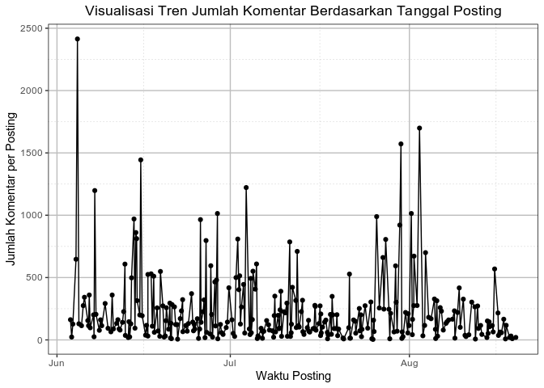
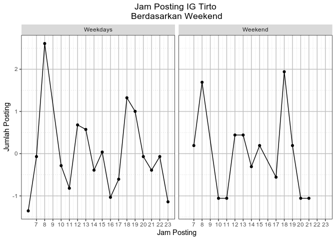
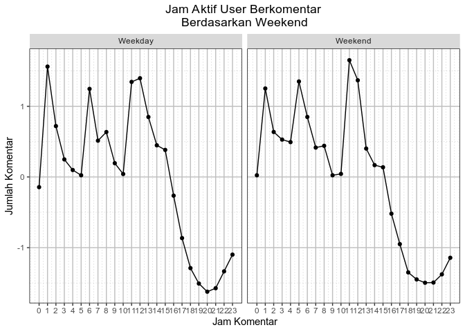
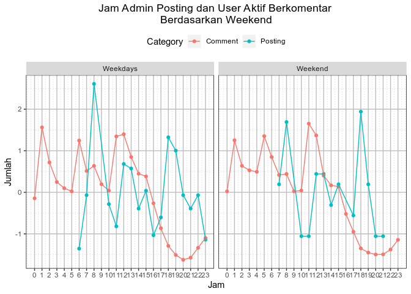
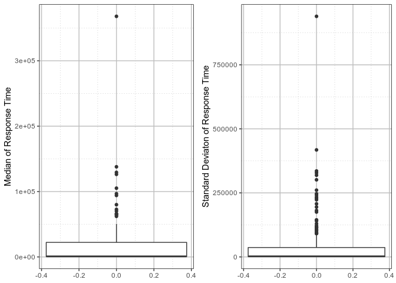

kamisdata: Analisis Instagram Tirto
================
Author: IFN

## Import Data

``` r
load('../data/tirto_posts.rda')
```

Karena kita `load` data `.rda` maka di dalam environment kita ada objek
baru bernama `tirto_post`. Saya tidak terbayang seberapa besar. Karena
itu saya mau lihat variabel apa saja yang ada, berapa besar dimensinya,
dan isinya seperti apa?

### Data Examination

``` r
names(tirto_posts) # melihat nama kolom
```

    ##  [1] "id"                "post_time"         "is_video"         
    ##  [4] "caption"           "tags"              "n_tags"           
    ##  [7] "video_view"        "media_like"        "comments_username"
    ## [10] "comments_time"     "comments_text"     "n_comments"

``` r
dim(tirto_posts) # melihat jumlah kolom
```

    ## [1] 300  12

``` r
head(tirto_posts) # melihat data-data teratas
```

    ##   id           post_time is_video
    ## 1  1 2019-08-19 10:04:56    FALSE
    ## 2  2 2019-08-18 19:31:03    FALSE
    ## 3  3 2019-08-18 14:00:42     TRUE
    ## 4  4 2019-08-18 08:01:05    FALSE
    ##                                                                                                                                                                                                                                                                                      caption
    ## 1                                       Henlo sobat seperlirikan! Ketimbang bingung lirik kanan lirik kiri malah bikin mata sepet-pegel-perih lebih baik ikutan Dry Eyes Lyric Battle yuk! Ciptakan lirik asikmu dan segarkan mata keringmu. Baca aturan mainnya ya #AduLirikMataKering #Ads
    ## 2                  YouTube menjelma jadi salah satu ladang pendapatan. Melalui vlog, banyak orang berusaha menambah pundi-pundi uang dan mendapatkan sedikit ketenaran. Simak yuk di Instastory akhir pekan kali ini, buat tahu lebih jauh mengenai vlog dan dinamika YouTube Indonesia! 📹 📱
    ## 3                                                                                                                                         Abis makan duren paling ena lanjut mimik kopi nih. Eh eh bukannya berbahaya y? Hmm..sambung di youtube tirto aja yuk biar lebih jelas. #EhTauNggak
    ## 4 Bagi Sjahrir, mendengar siaran radio bukan kegiatan pengisi waktu bosan saat bergelut dengan kemacetan atau gelagat pemuda kasmaran yang mau mengirim lagu atau pesan. Mendengar siaran radio adalah sebuah sikap revolusioner. Merdeka! #infografik #radio #kancamuda #sejarah #17agustus
    ##                                               tags n_tags video_view
    ## 1                          AduLirikMataKering, Ads      2         NA
    ## 2                                               NA      1         NA
    ## 3                                       EhTauNggak      1      25423
    ## 4 infografik, kancamuda, radio, 17agustus, sejarah      5         NA
    ##   media_like
    ## 1       1745
    ## 2       1196
    ## 3       2120
    ## 4       3941
    ##                                                                                                                                                                                                                                                                                                                                                                                                                 comments_username
    ## 1                                                                                                                                                              jarangmainjauh, afa_uchiha, gajelas_hidupgajelas_, arymeilyani, faishlmy, alifiantof, ilhamiztr, diensilvadien, badopinionindonesia, mzaky2803, mzaky2803, ramadhanhito_, jibunnnjya, windhuoez, iisekawulandari, xctaa, pgltm, momzsky, barca4evaaaa, chornelin.r
    ## 2                                                                                                                                                                                                                                                            raffbar1, hasbi_road.to_ti9, aulia_faridha_wk, arryyanwar, naufal_hendra, jullian_jeremy18, jullian_jeremy18, sehat_tinggi.ideal, josephine_antonia, padddddddyfield
    ## 3 hannayuliaaa, noviadwimulia, alinsyirahprimariani, mahardikaalie, ajengalamiahh, dyhangr, aseptianp_, widiadmojo, mas.ase, akbarauliamh, igomonroo, elmayosephine, epasuhuk, bagusuharto, fariha_husna, andri_wewe, terisoeta, muh_sultan_suhendar, muh_sultan_suhendar, mas.ase, joks_dw, syai23, nsrnaulia, camelfranz, adityamh__ig, mdnwanda, sehat_tinggi.ideal, mutiaranabs, annazhang77, my.name.is.fer, pangsit.karamel
    ## 4                                                                                                                                         ameliarakp, sehat_tinggi.ideal, navfaall, mrsokkidokkie, belajarsahamindonesia, alfimanzila, mferdiiii, windhuoez, bokkusen.dollmaker, deansuryatna, martin.p.3557, riyan.saputro, damorareza, ari3putra3, ernaaa_ss, perdana5670, rahard.joe, dia__f, rakafmbandung, salmaaprilianti14
    ##                                                                                                                                                                                                                                                                                                                                                                        comments_time
    ## 1                                                                                                                                     1566183978, 1566184226, 1566184324, 1566184984, 1566185087, 1566185156, 1566185181, 1566185220, 1566185275, 1566185559, 1566185592, 1566185725, 1566185929, 1566186090, 1566186138, 1566186267, 1566187827, 1566188171, 1566190907, 1566191406
    ## 2                                                                                                                                                                                                                                                             1566131523, 1566132462, 1566132746, 1566135960, 1566138321, 1566139760, 1566139786, 1566140821, 1566151686, 1566200207
    ## 3 1566111725, 1566112073, 1566112075, 1566112109, 1566112141, 1566112904, 1566112930, 1566114603, 1566114676, 1566114739, 1566115031, 1566118321, 1566118766, 1566119089, 1566119229, 1566120002, 1566120018, 1566120360, 1566120384, 1566120400, 1566121968, 1566123631, 1566124574, 1566125161, 1566133753, 1566141541, 1566147493, 1566155602, 1566167565, 1566171907, 1566186897
    ## 4                                                                                                                                     1566090164, 1566090325, 1566090407, 1566090420, 1566090507, 1566090992, 1566091850, 1566093284, 1566093640, 1566096829, 1566099474, 1566100448, 1566100699, 1566102011, 1566103086, 1566103491, 1566104864, 1566114688, 1566199634, 1566202474
    ##                                                                                                                                                                                                                                                                                                                                                                                                                                                                                                                                                                                                                                                                                                                                                                                                                                                                                                                                                                                                                                                                                                                                                                                                                                                                                                                                                                                                                                                                                                                                                                                                                                                                                                                                      comments_text
    ## 1                                                                                                                                                                                                                                  Gw denger suara radit, Nyanyi bareng sepanggung😌, Anjir iklan, Plis sambadi 😂😂, Ya allah nyanyi sepanggung sama radit 😥, Haaaaa nyanyi sepanggung sama Raditya Dika?? Wkwkwokwk ramashookk😂, Bayi ambil tanganku, @kupu.baja buat def, versi rock, Ya.. ya.. saya sekarang berdiri di sebelah lampu... lampu ini putih dan warnanya terang... seperti karir gue yang akan terus bersinar dan warnanya terang...😎 uh... sekarang di sini ada tangga...., Aduh.. Nyanyi sepanggung sama Raditya Dika.. Ga jadi daftar deh.. Intronya ntar Uu.. Uu... U.. U uuu... 🤣, @badopinionindonesia wrong yutuber, lol, @badopinionindonesia 🤣🤣🤣, @badopinionindonesia bgst! Akwoakwoakwo, Apabila dikata ulir seperti sekrup maka benda itu punya lintasan dan mencengkeram untuk mengikat dua ekiuvalen materi yang saling menguatkeun ,maka menginggatkeun akan anak kata voltaire pada sistem ekonomisnya dari pada memakai mur-baut yang harus memberi ring bishop pada lintasannya agar kelak mampu terlepas pada jajaran waktu ketika tidak dimungkinkeun untuk menyatukeun. Oke melihat tidaklah sama dengan mencermati sama halnya keinginan belum mampu terpetik untuk terbesit., @almas_hidayat nih Pam's, @badopinionindonesia salah server 😅, Suka banget sama enggresnya pak Tirto. 😘😘😘, Lah, Kenapa dengan @raditya_dika ? Emang dia penyanyi? Aku mau duwet ambek pak Tirto jeee, @mzaky2803 njir separuh aku😂, Hadiahnya, nyanyi sepanggung ama Raditya Dika ???!! Kok lgs merinding yaa... Ngeri gitu....
    ## 2                                                                                                                                                                                                                                                                                                                                                                                                                                                                                                                                                                                                                                                                                                                                                                                                                                                                                                                                                   Ekosistemnya udah gak sehat, Play one song : For legal reason that a joke2x, Iya, vlog halilintar yg sampe masuk youtube rewind 2018 lalu yg dapet predikat "video with the most dislike" sampe ngalahin videonya justin bieber itu. Wajar sih, setelah creditnya muncul trus pas liat nama channelnya halilintar, my first impression was "who the hell are they?" :/, Buset, udah pake gimbal, ditambah tripod pulak, randoh, Kalo di Indonesia, yang kurang itu creator nya sama kontennya, tapi kalo di luar, yang jelek itu system nya (juga sama orangnya dikit sih), @aulia_faridha_wk Facts 👍, Usiía 20 tâhuûn ke ataàs máasih bisa tinggiiî lhoö , yûu ceêk IG kami Cek BIÕ kámi langsüung kônsultàasikaàn ::):)), Ashiappp 😅, Tirto lagi libur ya ? Hari ini kayaknya sepi postingan
    ## 3 Hahah bisa aja mimin, 👏👏👏, Tp saya pernah liat ad yg juql kopi durian,.😂, akwoakwok, Kerennn👍, Malah kmrn boss w bawain kopi durian dari malaysia, mungkin pas bagian penjelasan narasumber ada bagian penyampaian secara langsung dari narasumbernya, biar lebih meyakinkan aja, Gak ada videonya di yutub :(, Berbahaya kalo makan minumnya di tengah jalan..., Tapi apakah kopi durian berbahaya? Hmm, Iya tau mitosnya..\nTapi pas gw di Palembang + musim durian, nyeduh kopi dicampur durian enaknya luar biasa dan itu budaya mereka pula.\nDan yg ngasih tau ke gw itu orang tua yang hampir 70 tahun umurnya., Durian durian apa yang seret??, Durian + Beer = 👍, Kayaknya itu mitos dari grup WhatsApp keluarga deh, Mimin meremehkan wifi kos saya? Wkwkwk, Yg ga boleb tub makan duren sama minum bir/anggur, o makan durian selain bikin mabok bisa bikin seret juga toh..(?), @mas.ase ohh gtu ya mas. Terima kasih atas sarannya mas 😆😆😅😅😅, Durian + anggur merah = 👏👏👍, @muh_sultan_suhendar sama-sama😅😅😅, @adiiakbr 👍, Disini Wonosalam Jombang, kalo makan Durian malah wajib ditemenin Kopi, dan mereka semua berumur panjang😂, pernah makan duren minumnya soda tetep idup gini, Gw makan duren minumnya martel b ja wkwkw, Makan tape durian+sate kambing 2 porsi dijamin bakal ada yang tahlilan dirimah anda.., Itulah sebabnya gw males makan durian, terlalu banyak rumusan pantangannya., Usiía 20 tâhuûn ke ataàs máasih bisa tinggiiî lhoö , yûu ceêk IG kami Cek BIÕ kámi langsüung kônsultàasikaàn ::):)), Ngapa gemes bgt ini kontennya😭, Yg bahaya itu klo makan durian ama kulitnya... Keselek lgsg ke dunia lain 😂, @dyhangr absolute madlad, Kalo ga boleh munim kopi abis makan duren apa kabar kopi duren 😂
    ## 4                                                                                                                                                                                                                                                                                                                                                                                                                                                                                                                                                                                                                                                                                 Radio Ga Ga, Térnyàtàâ üsiáä 20th ké àtas jugáä masîh bîsaaáa námbãh tinggiîî LHoöóõoo.  Cêk bîøõ yàâã, Mantap emang bung kecil, Radio adalah sosmed jaman old, kirim2 salam buat blablabla dari cewe scorpio blablabla 😆, @tirtoid ngapain waktu 1940-an ? 😊, Radio lebih abis daripada tv. Bisa di dengeri sambil belajar, main hp, sambil ngerjakan tugas rumah. Gak capek jika dibanding nonton tv, Sheila on 7 - Radio. Menemani masa2 smp kuu, Radio philips ,walah sama sama radio kata kasino pada bapak guru indro., @mferdiiii inget jaman old bisa bikin boneka jaman itu lagi loh di @bokkusen.dollmaker, Dengan radio.... Aku sampaikan... Kemerdekaan indonesia #NyanyiSheilaOn7, Radio gaga  Queen, Komunikasi, Tetap kalo bawa mobil teman setia adalah radio.. kecuali keluar kota 😂, #gombloh  #kugadaikancintaku  #😅 #padahariminggukuturutayahkekotanaikdelmanistimewadisampingpakusiryangsedangbekerja, 😍, I missed my radio 😁, Sekarang beralih ke podcast, @mrsokkidokkie saya pernah request lagu plus kirim salam pas SMA wkwk, 😍😊😎🙏, 0
    ##   n_comments
    ## 1         20
    ## 2         10
    ## 3         31
    ## 4         20
    ##  [ reached 'max' / getOption("max.print") -- omitted 2 rows ]

Secara sekilas dari data yang ada 12 kolom dan 300 baris. 12 kolom itu
merepresentasikan dengan nama kolom:

  - `id` nomor urut data
  - `post_time` waktu posting di IG, tanggal, jam, menit, dan detik
  - `is_video` apakah postingnya berupa video
  - `caption` caption apa yang digunakan di dalam posting
  - `tags` tags apa yang digunakan di dalam posting
  - `n_tags` berapa banyak tags
  - `video_view` berapa banyak video dilihat
  - `media_like`
  - `comments_username` siapa saja yang comment di dalam posting
  - `comment_time` tanggal, jam, menit dan detik berapa comment terjadi
  - `comments_text` apa yang dikomen
  - `n_comments` berapa banyak komen di satu posting?

Ada beberapa hal yang dapat dilihat dari hasil diatas:

  - Pada nama kolom `video_view` ada data `NA`. Ini kemungkinan
    disebabkan karena posting yang tidak mengandung video tidak ada
    datanya.
  - Pada kolom `comment_username`, `comment_time`, dan `comment_text`
    isi adanya `<chr[angka]>`. Ini menandakan bahwa satu kolom data ada
    list variabel sepanjang `angka` dengan jenis character. Data ini
    disebabkan satu posting ada kemungkinan menyimpan lebih dari satu
    komen. Agar lebih rapi, data tersebut diubah menjadi list variable
    dan disimpan dalam satu baris yang sama dengan posting awal.

## Analisis Data

Kali ini bisa dibilang bukan kamisdata saya yang pertama, tapi ini
kamisdata yang pertama saya selesaikan 😄. Jadi, sekarang buat analisis
yang sederhana-sederhana aja.

### Package

``` r
library(tidyverse)
library(lubridate) # untuk bekerja dengan data waktu
library(purrr) # untuk fungsi iterasi fungsi
library(gridExtra)
```

### Tema Grafik

Karena nanti akan banyak menggunakan plot `ggplot2`, saya akan buat tema
sederhana biar lebih enak dilihat.

``` r
plot_theme <- theme(legend.position = 'top', 
                    panel.background = element_rect(fill = 'white'), 
                    panel.grid.major = element_line(colour = 'grey'),
                    panel.grid.minor = element_line(colour = 'grey',
                                                    linetype = 3), 
                    panel.border = element_rect(colour = 'black', 
                                                fill = NA), 
                    plot.title = element_text(hjust = 0.5))
```

### Posting dan Komentar

Fitur pertama yang langsung menarik perhatian saya adalah interaksi
pembaca IG tirto yang dilihat dari jumlah komen secara waktu. Apakah ada
pola tertentu? Tapi harus diingat bahwa posting tirto tidak ada pola,
sehingga mungkin juga tidak membentuk pola tertentu karena ada
kemungkinan pembaca lebih engage dengan posting beritanya.

``` r
ggplot(tirto_posts, aes(x = post_time, y = n_comments)) + 
  geom_point() + geom_line() + 
  labs(x = 'Waktu Posting',
       y = 'Jumlah Komentar per Posting', 
       title = 'Visualisasi Tren Jumlah Komentar Berdasarkan Tanggal Posting') + 
  plot_theme
```



Jika dilihat dari grafik diatas, dapat ditarik kesimpulan secara waktu
tidak ada pola jelas dari jumlah komentar berdasarkan tanggal
postingnya. Tapi ini mungkin menjadi tidak valid, karena tanggal yang
digunakan itu tanggal posting, bukan tanggal komentar dibuat. Data
diatas hanya menunjukkan satu posting itu ada berapa banyak komentar
saja. Bukan interaksi berdasarkan waktu. Oleh karena itu, mari kita
bedah waktu user menggunggah komentar. Tapi sebelum itu, data tanggal
komentar tersebut masih berupa list variabel. Sekarang kita coba lihat
berdasarkan jam dan Weekend atau tidak.

Secara kuantitas, hari Weekdays pasti lebih banyak daripada Weekend.
Sehingga, agar seimbang, maka akan dilakukan standardisasi menjadi
z-value. Agar kedua jenis hari ini dapat dibandingkan.

``` r
tirto_posts %>%
  mutate(jam = hour(post_time), 
         weekdays = weekdays(post_time), 
         weekend = ifelse(weekdays %in% c('Sunday', 'Saturday'), 
                          'Weekend', 'Weekdays')) %>%
  count(jam, weekend) %>%
  group_by(weekend) %>%
  mutate(scale_n = scale(n)) %>%
  ggplot(aes(x = jam, y = scale_n)) + 
  geom_line() + geom_point() + plot_theme + facet_wrap(.~weekend) +
  labs(x = 'Jam Posting', 
       y = 'Jumlah Posting', 
       title = 'Jam Posting IG Tirto \nBerdasarkan Weekend') +
  scale_x_continuous(breaks = c(7:23))
```



Sekilas dapat dilihat bahwa pola posting admin IG tirto pada hari
Weekdays dan Weekend memiliki pola yang berbeda. Akun IG Tirto paling
banyak melakukan posting sekitar jam 8 pagi, kemudian jam 12-13 siang,
dan jam 18. Hal ini mencoba menangkap pola pekerja yang masuk pada jam
8-9, istirahat pada jam 12-13, dan pulang dari kantor jam 18. Sedangkan
pada hari Weekend, aktifitas posting pagi tidak berubah, malah lebih
banyak posting pada sore, jam 18.

``` r
tanggal_komentar <- unlist(tirto_posts$comments_time)
head(tanggal_komentar)
```

    ## [1] 1566183978 1566184226 1566184324 1566184984 1566185087 1566185156

``` r
tanggal_komentar <- as_datetime(tanggal_komentar)
head(tanggal_komentar)
```

    ## [1] "2019-08-19 03:06:18 UTC" "2019-08-19 03:10:26 UTC"
    ## [3] "2019-08-19 03:12:04 UTC" "2019-08-19 03:23:04 UTC"
    ## [5] "2019-08-19 03:24:47 UTC" "2019-08-19 03:25:56 UTC"

Mengelompokkan berdasarkan tanggal, jam, dan weekend

``` r
tanggal_komentar_df <- data.frame(tanggal_komentar, 
                                  tanggal = date(tanggal_komentar),
                                  jam = hour(tanggal_komentar),
                                  weekdays = weekdays(tanggal_komentar))
head(tanggal_komentar_df)
```

    ##      tanggal_komentar    tanggal jam weekdays
    ## 1 2019-08-19 03:06:18 2019-08-19   3   Monday
    ## 2 2019-08-19 03:10:26 2019-08-19   3   Monday
    ## 3 2019-08-19 03:12:04 2019-08-19   3   Monday
    ## 4 2019-08-19 03:23:04 2019-08-19   3   Monday
    ## 5 2019-08-19 03:24:47 2019-08-19   3   Monday
    ## 6 2019-08-19 03:25:56 2019-08-19   3   Monday

``` r
tanggal_komentar_df %>%
  mutate(weekend = ifelse(weekdays %in% c('Sunday', 'Saturday'), 'Weekend', 'Weekday')) %>%
  count(jam, weekend) %>% 
  group_by(weekend) %>%
  mutate(scale_n = scale(n)) %>%
  ggplot(aes(x = jam, y = scale_n)) + 
  geom_line() + geom_point() + plot_theme + facet_wrap(.~weekend) + 
  labs(x = 'Jam Komentar', 
       y = 'Jumlah Komentar', 
       title = 'Jam Aktif User Berkomentar \nBerdasarkan Weekend') +
  scale_x_continuous(breaks = c(0:23))
```



Dari pola aktifitas comment user IG, dapat dilihat bahwa user IG
memiliki pola penggunaan IG yang kurang lebih sama antara Weekdays, dan
Weekend. Paling banyak user mengirimkan komentar pada jam 1 pagi, jam 6
pagi, dan jam 11-12. Pola tersebut tidak berubah pada Weekend, tapi
lebih tinggi pada jam 11-12. Hal ini menarik karena, user pada Weekdays
paling banyak memberikan komentar pada jam 1 dini hari, yang berarti
user sedang lembur/terbangun dari tidur/nongkrong yang mendorong dia
untuk membuat IG. Yang kedua, sepertinya user juga banyak membuka IG
ketika dalam perjalanan ke tempat kerja. Sehingga bisa diasumsikan
sebagian besar pembaca akun IG tirto adalah komuter. User ini pun tidak
tertarik untuk memberikan komen ketika sudah jam pulang kantor, yaitu
sekitar jam 17-18.

#### Kesimpulan

``` r
posting_df <- tirto_posts %>%
  mutate(jam = hour(post_time), 
         weekdays = weekdays(post_time), 
         weekend = ifelse(weekdays %in% c('Sunday', 'Saturday'), 
                          'Weekend', 'Weekdays')) %>%
  count(jam, weekend) %>%
  group_by(weekend) %>%
  mutate(scale_n = scale(n), category = 'Posting')

comment_df <- tanggal_komentar_df %>%
  mutate(weekend = ifelse(weekdays %in% c('Sunday', 'Saturday'), 'Weekend', 'Weekdays')) %>%
  count(jam, weekend) %>% 
  group_by(weekend) %>%
  mutate(scale_n = scale(n), category = 'Comment') 

combined_df <- rbind(posting_df, comment_df)

combined_df %>%
  ggplot(aes(x = jam, y = scale_n, colour = category)) + 
  geom_point() + geom_line() + facet_wrap(.~weekend) + 
  labs(x = 'Jam', 
       y = 'Jumlah', 
       title = 'Jam Admin Posting dan User Aktif Berkomentar \nBerdasarkan Weekend') +
  scale_x_continuous(breaks = c(0:23)) + plot_theme +
  scale_color_discrete(name = 'Category')
```



Aktifitas posting admin IG dan user yang mengirimkan komen tidak dalam
pola yang sama. Dengan mengasumsikan admin tirto memiliki jam kerja
normal (8-18) maka wajar jika tidak ada postingan IG tirto pada jam 1
pagi walau banyak user yang memberikan komen. Sebaliknya, admin tirto
yang posting pada jam 18, cenderung tidak mendapatkan respon banyak
karena user sudah tidak aktif pada jam itu.

### Diskusi

Hal lain yang menarik bagi saya adalah seberapa lama user engaged dalam
suatu post? Hal ini dapat dilihat dari jarak posting terhadap
komentar-komentar yang dikirimkan oleh user. Semakin lama jarak waktu
antara posting dan comment maka itu dapat diartikan posting IG tersebut
memiliki engagement yang besar.

``` r
response_list <- map(tirto_posts$comments_time, as_datetime)

temp <- NULL
for (i in seq_along(response_list)) {
  temp[[i]] <- response_list[[i]] - tirto_posts$post_time[i]
}

median_time <- data.frame(median_time = unlist(map(temp, mean)))
sd_time <- data.frame(sd_time = unlist(map(temp, sd)))

tirto_posts_df <- cbind(tirto_posts, median_time, sd_time)

head(tirto_posts_df)
```

    ##   id           post_time is_video
    ## 1  1 2019-08-19 10:04:56    FALSE
    ## 2  2 2019-08-18 19:31:03    FALSE
    ## 3  3 2019-08-18 14:00:42     TRUE
    ##                                                                                                                                                                                                                                                                     caption
    ## 1                      Henlo sobat seperlirikan! Ketimbang bingung lirik kanan lirik kiri malah bikin mata sepet-pegel-perih lebih baik ikutan Dry Eyes Lyric Battle yuk! Ciptakan lirik asikmu dan segarkan mata keringmu. Baca aturan mainnya ya #AduLirikMataKering #Ads
    ## 2 YouTube menjelma jadi salah satu ladang pendapatan. Melalui vlog, banyak orang berusaha menambah pundi-pundi uang dan mendapatkan sedikit ketenaran. Simak yuk di Instastory akhir pekan kali ini, buat tahu lebih jauh mengenai vlog dan dinamika YouTube Indonesia! 📹 📱
    ## 3                                                                                                                        Abis makan duren paling ena lanjut mimik kopi nih. Eh eh bukannya berbahaya y? Hmm..sambung di youtube tirto aja yuk biar lebih jelas. #EhTauNggak
    ##                      tags n_tags video_view media_like
    ## 1 AduLirikMataKering, Ads      2         NA       1745
    ## 2                      NA      1         NA       1196
    ## 3              EhTauNggak      1      25423       2120
    ##                                                                                                                                                                                                                                                                                                                                                                                                                 comments_username
    ## 1                                                                                                                                                              jarangmainjauh, afa_uchiha, gajelas_hidupgajelas_, arymeilyani, faishlmy, alifiantof, ilhamiztr, diensilvadien, badopinionindonesia, mzaky2803, mzaky2803, ramadhanhito_, jibunnnjya, windhuoez, iisekawulandari, xctaa, pgltm, momzsky, barca4evaaaa, chornelin.r
    ## 2                                                                                                                                                                                                                                                            raffbar1, hasbi_road.to_ti9, aulia_faridha_wk, arryyanwar, naufal_hendra, jullian_jeremy18, jullian_jeremy18, sehat_tinggi.ideal, josephine_antonia, padddddddyfield
    ## 3 hannayuliaaa, noviadwimulia, alinsyirahprimariani, mahardikaalie, ajengalamiahh, dyhangr, aseptianp_, widiadmojo, mas.ase, akbarauliamh, igomonroo, elmayosephine, epasuhuk, bagusuharto, fariha_husna, andri_wewe, terisoeta, muh_sultan_suhendar, muh_sultan_suhendar, mas.ase, joks_dw, syai23, nsrnaulia, camelfranz, adityamh__ig, mdnwanda, sehat_tinggi.ideal, mutiaranabs, annazhang77, my.name.is.fer, pangsit.karamel
    ##                                                                                                                                                                                                                                                                                                                                                                        comments_time
    ## 1                                                                                                                                     1566183978, 1566184226, 1566184324, 1566184984, 1566185087, 1566185156, 1566185181, 1566185220, 1566185275, 1566185559, 1566185592, 1566185725, 1566185929, 1566186090, 1566186138, 1566186267, 1566187827, 1566188171, 1566190907, 1566191406
    ## 2                                                                                                                                                                                                                                                             1566131523, 1566132462, 1566132746, 1566135960, 1566138321, 1566139760, 1566139786, 1566140821, 1566151686, 1566200207
    ## 3 1566111725, 1566112073, 1566112075, 1566112109, 1566112141, 1566112904, 1566112930, 1566114603, 1566114676, 1566114739, 1566115031, 1566118321, 1566118766, 1566119089, 1566119229, 1566120002, 1566120018, 1566120360, 1566120384, 1566120400, 1566121968, 1566123631, 1566124574, 1566125161, 1566133753, 1566141541, 1566147493, 1566155602, 1566167565, 1566171907, 1566186897
    ##                                                                                                                                                                                                                                                                                                                                                                                                                                                                                                                                                                                                                                                                                                                                                                                                                                                                                                                                                                                                                                                                                                                                                                                                                                                                                                                                                                                                                                                                                                                                                                                                                                                                                                                                      comments_text
    ## 1                                                                                                                                                                                                                                  Gw denger suara radit, Nyanyi bareng sepanggung😌, Anjir iklan, Plis sambadi 😂😂, Ya allah nyanyi sepanggung sama radit 😥, Haaaaa nyanyi sepanggung sama Raditya Dika?? Wkwkwokwk ramashookk😂, Bayi ambil tanganku, @kupu.baja buat def, versi rock, Ya.. ya.. saya sekarang berdiri di sebelah lampu... lampu ini putih dan warnanya terang... seperti karir gue yang akan terus bersinar dan warnanya terang...😎 uh... sekarang di sini ada tangga...., Aduh.. Nyanyi sepanggung sama Raditya Dika.. Ga jadi daftar deh.. Intronya ntar Uu.. Uu... U.. U uuu... 🤣, @badopinionindonesia wrong yutuber, lol, @badopinionindonesia 🤣🤣🤣, @badopinionindonesia bgst! Akwoakwoakwo, Apabila dikata ulir seperti sekrup maka benda itu punya lintasan dan mencengkeram untuk mengikat dua ekiuvalen materi yang saling menguatkeun ,maka menginggatkeun akan anak kata voltaire pada sistem ekonomisnya dari pada memakai mur-baut yang harus memberi ring bishop pada lintasannya agar kelak mampu terlepas pada jajaran waktu ketika tidak dimungkinkeun untuk menyatukeun. Oke melihat tidaklah sama dengan mencermati sama halnya keinginan belum mampu terpetik untuk terbesit., @almas_hidayat nih Pam's, @badopinionindonesia salah server 😅, Suka banget sama enggresnya pak Tirto. 😘😘😘, Lah, Kenapa dengan @raditya_dika ? Emang dia penyanyi? Aku mau duwet ambek pak Tirto jeee, @mzaky2803 njir separuh aku😂, Hadiahnya, nyanyi sepanggung ama Raditya Dika ???!! Kok lgs merinding yaa... Ngeri gitu....
    ## 2                                                                                                                                                                                                                                                                                                                                                                                                                                                                                                                                                                                                                                                                                                                                                                                                                                                                                                                                                   Ekosistemnya udah gak sehat, Play one song : For legal reason that a joke2x, Iya, vlog halilintar yg sampe masuk youtube rewind 2018 lalu yg dapet predikat "video with the most dislike" sampe ngalahin videonya justin bieber itu. Wajar sih, setelah creditnya muncul trus pas liat nama channelnya halilintar, my first impression was "who the hell are they?" :/, Buset, udah pake gimbal, ditambah tripod pulak, randoh, Kalo di Indonesia, yang kurang itu creator nya sama kontennya, tapi kalo di luar, yang jelek itu system nya (juga sama orangnya dikit sih), @aulia_faridha_wk Facts 👍, Usiía 20 tâhuûn ke ataàs máasih bisa tinggiiî lhoö , yûu ceêk IG kami Cek BIÕ kámi langsüung kônsultàasikaàn ::):)), Ashiappp 😅, Tirto lagi libur ya ? Hari ini kayaknya sepi postingan
    ## 3 Hahah bisa aja mimin, 👏👏👏, Tp saya pernah liat ad yg juql kopi durian,.😂, akwoakwok, Kerennn👍, Malah kmrn boss w bawain kopi durian dari malaysia, mungkin pas bagian penjelasan narasumber ada bagian penyampaian secara langsung dari narasumbernya, biar lebih meyakinkan aja, Gak ada videonya di yutub :(, Berbahaya kalo makan minumnya di tengah jalan..., Tapi apakah kopi durian berbahaya? Hmm, Iya tau mitosnya..\nTapi pas gw di Palembang + musim durian, nyeduh kopi dicampur durian enaknya luar biasa dan itu budaya mereka pula.\nDan yg ngasih tau ke gw itu orang tua yang hampir 70 tahun umurnya., Durian durian apa yang seret??, Durian + Beer = 👍, Kayaknya itu mitos dari grup WhatsApp keluarga deh, Mimin meremehkan wifi kos saya? Wkwkwk, Yg ga boleb tub makan duren sama minum bir/anggur, o makan durian selain bikin mabok bisa bikin seret juga toh..(?), @mas.ase ohh gtu ya mas. Terima kasih atas sarannya mas 😆😆😅😅😅, Durian + anggur merah = 👏👏👍, @muh_sultan_suhendar sama-sama😅😅😅, @adiiakbr 👍, Disini Wonosalam Jombang, kalo makan Durian malah wajib ditemenin Kopi, dan mereka semua berumur panjang😂, pernah makan duren minumnya soda tetep idup gini, Gw makan duren minumnya martel b ja wkwkw, Makan tape durian+sate kambing 2 porsi dijamin bakal ada yang tahlilan dirimah anda.., Itulah sebabnya gw males makan durian, terlalu banyak rumusan pantangannya., Usiía 20 tâhuûn ke ataàs máasih bisa tinggiiî lhoö , yûu ceêk IG kami Cek BIÕ kámi langsüung kônsultàasikaàn ::):)), Ngapa gemes bgt ini kontennya😭, Yg bahaya itu klo makan durian ama kulitnya... Keselek lgsg ke dunia lain 😂, @dyhangr absolute madlad, Kalo ga boleh munim kopi abis makan duren apa kabar kopi duren 😂
    ##   n_comments median_time   sd_time
    ## 1         20    37.60167  33.30251
    ## 2         10   214.40333 341.35796
    ## 3         31   247.72312 324.83226
    ##  [ reached 'max' / getOption("max.print") -- omitted 3 rows ]

``` r
g1 <- ggplot(tirto_posts_df, aes(y = median_time)) + 
  geom_boxplot() + labs(y = "Median of Response Time") + 
  plot_theme

g2 <- ggplot(tirto_posts_df, aes(y = sd_time)) + 
  geom_boxplot() + labs(y = "Standard Deviaton of Response Time") + 
  plot_theme

grid.arrange(g1, g2, ncol = 2)
```



Dapat dilihat ada outliers yang cukup besar, baik itu dari median atau
standard deviasi tentang response time yang didapat dari user IG. Kedua
metrik yang besar ini menunjukan bahwa tidak semua posting menghasilkan
engagement yang sama bagi user. Karena ada posting yang masih
mendapatkan komen walaupun masih lama, sedangkan yang lain tidak. Mari
kita lihat postingan apa saja yang menghasilkan user engage. Karena dari
tabel diatas hanya menghasilkan outliers diatas, maka saya akan hanya
berfokus pada outliers pada bagian atas saja.

``` r
tirto_posts_df <- tirto_posts_df %>%
  mutate(is_out_median = ifelse(median_time > (mean(median_time) + IQR(median_time)), TRUE, FALSE), 
         is_out_sd = ifelse(sd_time > (mean(sd_time) + IQR(sd_time)), TRUE, FALSE))

tirto_posts_df %>%
  select(caption, median_time, sd_time) %>%
  arrange(-median_time, -sd_time) %>%
  top_n(8)
```

    ## Selecting by sd_time

    ##                                                                                                                                                                                                                                                                                                                                                                                                                           caption
    ## 1                                                                                                                                                                                                      Glioblastoma adalah jenis kanker otak yang paling agresif. Ia timbul dari glia atau prekursor dalam sistem saraf pusat dan bisa langsung muncul dalam bentuk kanker grade IV. #infografik #kesehatan #kanker #glioblastoma
    ## 2                                                                                                                                                                                                                                                                  Danau Toba kini telah memiliki semua aspek: atraksi memikat, akses memadai, dan amenitas premium yang bikin liburan makin nyaman. Siap berangkat ke sana? #ads
    ## 3                                                                                                                                                                                                                                             Google memfasilitasi para tuli dengan Live Transcribe, aplikasi yang mampu menerjemahkan suara jadi teks secara real-time. Yay Google! #google #tuli #aplikasi #infografik #android
    ## 4                                                                                                                                                                                                                                                                               Hidup dalam ketaatan beragama tak mesti kaku dan tegang. Sebagian orang justru menghayati nilai-nilainya melalui humor. #infografik #agama #humor
    ## 5                                                                                                                                                                                                                                               Sebelum menawar gaji lima juta melyar sebulan, pikirkan dulu nilai apa yang bisa kamu tawarkan sebagai ganti jumlah gaji yang kamu tuntut. #infografik #gaji #keuangan #pekerjaan
    ## 6                                                                                                                                                                                                                                                                                                                                                                                         Don't shoot the messenger 🤷 #Tirtografi
    ## 7                                                                                                                                                                                                                                                                                                                                                                 Apa lagi yang syariah setelah ini? Tirto Syariah? 🤔 #Tirtografi
    ## 8 Tidak ada salahnya mendengarkan musik sedih jika suasana hatimu sedang kacau. Mungkin pada akhirnya, kamu justru bisa merasa lebih baik karena itu. Keep calm and listen to sad songs! 🤗 🎶P.S.: Jika kamu merasa membutuhkan bantuan lebih lanjut, jangan segan-segan untuk menghubungi orang-orang terdekatmu atau mencari bantuan dari tenaga profesional ya 😊 #infografik #depression #mentalhealth #musik #sadboi #sadnight
    ##   median_time  sd_time
    ## 1   368013.69 939295.1
    ## 2   137856.62 335421.3
    ## 3   129324.34 301040.4
    ## 4   126329.08 328185.9
    ## 5    96743.52 318951.5
    ## 6    94034.11 260554.2
    ## 7    70120.42 246570.7
    ## 8    66053.94 417764.8

#### Rasio Jumlah Diskusi per Unique Username

Tirto merupakan portal berita yang sering mengundang diskusi bagi para
user, sehingga menarik jika mengkaji postingan mana yang mengundang user
untuk diskusi. Metrik ini dapat dilihat dengan rasio antara jumlah
komentar per jumlah unique username. Sehingga akan terlihat, secara
rata-rata per satu username berapa banyak yang ditulis. Oleh karena itu,
kita harus menghitung unique username.

``` r
unique_length <- function(x) {
  length(unique(x))
}

unique_commentators <- unlist(map(tirto_posts$comments_username, unique_length))
unique_commentators_ratio <- tirto_posts$n_comments / unique_commentators

tirto_posts_df$comment_ratio <- unique_commentators_ratio

tirto_posts_df %>% 
  ggplot(aes(x = comment_ratio)) + geom_histogram(bins = 50) +
  plot_theme + labs(x = "Comment Ratio", y = "Count")
```


Dari histogram diatas dapat dilihat, ada beberapa posting yang memiliki
comment ratio yang besar, yaitu diatas 4. Kita juga dapat mengamati
comment ratio yang tidak terlalu besar berkisar diatas 2. Kali ini kita
akan mengurutkan posting yang memiliki comment ratio diatas 2,
berdasarkan yang paling banyak mengundang diskusi

``` r
tirto_posts_df %>%
  filter(comment_ratio > 2) %>%
  arrange(-comment_ratio) %>%
  select(caption, comment_ratio)
```

    ##                                                                                                                                                                                                                                                                              caption
    ## 1                                      Pemikiran Mukti Ali yang terpenting dan relevan hingga kini adalah peran ilmu agama untuk menjawab problem masyarakat modern. Ilmu agama harus bisa digunakan untuk mengembangkan kerukunan dan kedamaian. #infografik #tokoh #islam #sejarah
    ## 2                                                 Berbicara tentang Giordano Bruno adalah bicara tentang manusia yang berusaha mendobrak kuatnya cengkeraman dogma gereja pada Eropa abad pertengahan. Ia mati sebagai martir pengetahuan. #infografik #sejarah #pengetahuan #filsuf
    ## 3         Hingga kini, aborsi di Indonesia masih sering dianggap tabu. Masih banyak perdebatan yang menghantui legalitas aborsi. Sampai pada akhirnya ada harga yang harus dibayar mahal, yaitu banyaknya praktik aborsi yang mengancam nyawa. #infografik #aborsi #hukum #kesehatan
    ## 4 Ibn Battuta bukan wartawan National Geographic, bukan pula pesohor-pelancong Instagram, atau penulis buku-buku semacam “Panduan Hemat Melancong ke Skandinavia”. Ia hanya seorang terpelajar yang penasaran melihat dunia dan mencatatnya. #infografik #sejarah #muslim #adventure
    ## 5                                                                                                                          Gempa yang paling sering terjadi adalah gempa dangkal. Gempa jenis ini bisa sebabkan gelombang tsunami juga meskipun terjadi di daratan.#gempabumi #gempa
    ## 6                                                                                                                                                                                                          Rekan-rekan karyawati, thoughts? #infografik #highheels #perempuan #girls
    ## 7                                                                                                                                                     Sering dialami perempuan, tapi tidak semuanya sadar bahwa Cat calling adalah salah satu bentuk pelecehan seksual 😾 #Tirtografi
    ## 8                                               Pandangan masyarakat Indonesia terhadap komunitas LGBT berkelindan dengan isu penyakit sosial dan ajaran agama. Sebagian besar masih percaya LGBT merupakan penyakit yang dapat disembuhkan. #infografik #riset #LGBT #sosial #agama
    ## 9                                                                     Haji Misbach percaya Islam dan komunisme punya kesamaan nilai dalam memandang manusia. Dua alat ini yang ia gunakan sebagai senjata perjuangan buat melawan penindasan. #infografik #islam #komunisme #politik
    ##   comment_ratio
    ## 1      4.333333
    ## 2      2.719577
    ## 3      2.367521
    ## 4      2.360294
    ## 5      2.354839
    ## 6      2.153285
    ## 7      2.092050
    ## 8      2.069428
    ## 9      2.030278

Jika dilihat secara sekilas maka topik yang banyak mengundang diskusi
pada IG Tirto adalah yang bertema islam, fenimisme, dan LGBTQ. Ketiga
hal ini pula yang mengundang banyak diskusi di dalam masyarakat dan
media massa. Sehingga tidak heran ketiga hal tersebut menjadi hal yang
banyak didiskusikan di dalam IG Tirto.
