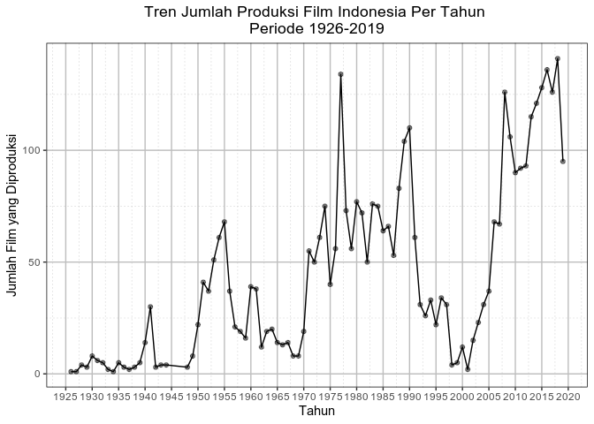
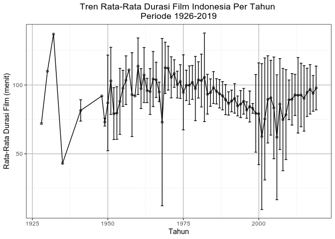
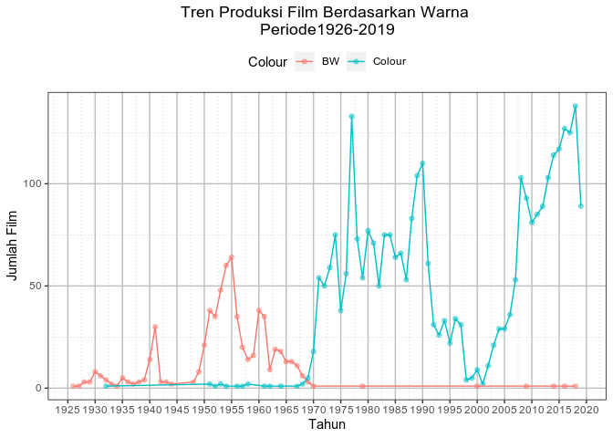
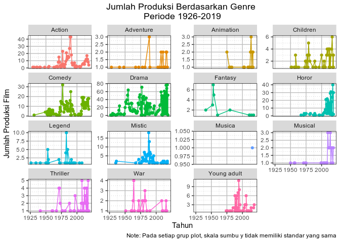
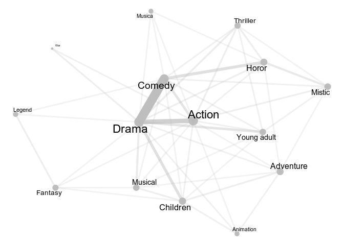

kamisdata: Analisis Data Film Indonesia
================
IFN
9/8/2019

## Import Data

Saya akan mengimport data yang sudah dipersiapkan di Github Komunitas R
indonesia. Data tersebut ada di dalam folder `/data/filindonesia.rda`.

``` r
load('../data/filmindonesia.rda')
head(filmindonesia)
```

    ##                title  genre year release_date colour duration
    ## 1 Loetoeng Kasaroeng Legend 1926         <NA>     BW       NA
    ## 2        Eulis Atjih  Drama 1927         <NA>     BW       NA
    ## 3      Lily van Java  Drama 1928         <NA>     BW       NA
    ##   classification rating                        producer     director
    ## 1           <NA>     NA                    L Heuveldorp L Heuveldorp
    ## 2           <NA>     NA                            <NA>    G Krugers
    ## 3           <NA>     NA Liem Goan Lian, Tjan Tjoen Lian  Nelson Wong
    ##    writer                                                  actress
    ## 1    <NA>                                          Martoana, Oemar
    ## 2 Joehana                                           Arsad, Soekria
    ## 3    <NA> Lie Lian Hoa, Lie Bouw Tan, Kwee Tiang An, Yah Kwee Pang
    ##                                                                                                                                                                                                                                                                                                                                                                                                                                                                                                                           synopsis
    ## 1 Walau dibikin oleh orang asing, tapi ini film cerita pertama di Indonesia yang menampilkan cerita asli Indonesia, sebuah legenda yang terkenal dari Jawa Barat. Antara lain berisi nasehat, janganlah memandang sesuatu dari kulitnya saja. Purbasari diejek karena punya pacar seekor lutung (Guru Minda), sedangkan kakaknya Purbararang membanggakan kekasihnya, Indrajaya yang manusia. Ternyata lutung itu sebetulnya adalah seorang pangeran tampan, titisan dewi Sunan Ambu. Guru Minda jauh lebih tampan dari Indrajaya.
    ## 2                                                                                                                                                                                                                                                                                                                            Seorang suami meninggalkan isteri dan anak untuk berfoya-foya. Si isteri, Eulis Atjih dan anaknya hidup melarat. Di kemudian hari ia tetap menerima kembalinya (bekas) suami yang telah jatuh miskin.
    ## 3                                                                                                                                                                                                                                                                                                                                                                   Kisah seorang gadis anak hartawan yang oleh ayahnya dipaksa menikah dengan seorang pemuda, sedangkan gadis itu telah punya hubungan asmara dengan pemuda lain.
    ##  [ reached 'max' / getOption("max.print") -- omitted 3 rows ]

Dengan membuka `.rda` file dari `kamisdata` maka, di dalam environment
kita akan muncul objek `filmindonesia` yang sudah disiapkan dan
dibersihkan oleh `aswansyahputra`. Secara sekilas kita dapat melihat isi
data. Data bagian awal terdapat banyak nilai `NA`, sehingga nanti akan
kita cek lebih lanjut berapa banyak nilai `NA` dari setiap kolom. Kolom
dengan nilai `NA` banyak akan di drop dengan justifikasi untuk membuat
analisis yang
    meaningful.

## Data Examination

``` r
names(filmindonesia)
```

    ##  [1] "title"          "genre"          "year"           "release_date"  
    ##  [5] "colour"         "duration"       "classification" "rating"        
    ##  [9] "producer"       "director"       "writer"         "actress"       
    ## [13] "synopsis"

``` r
dim(filmindonesia)
```

    ## [1] 3993   13

``` r
colSums(is.na(filmindonesia))
```

    ##          title          genre           year   release_date         colour 
    ##              0            217              0           2647            200 
    ##       duration classification         rating       producer       director 
    ##            864           2863           2420            488            150 
    ##         writer        actress       synopsis 
    ##            469            161            210

``` r
colSums(is.na(filmindonesia)) / nrow(filmindonesia) * 100
```

    ##          title          genre           year   release_date         colour 
    ##       0.000000       5.434510       0.000000      66.291009       5.008765 
    ##       duration classification         rating       producer       director 
    ##      21.637866      71.700476      60.606061      12.221387       3.756574 
    ##         writer        actress       synopsis 
    ##      11.745555       4.032056       5.259204

Secara sekilas dari data yang ada 13 kolom dan 3993 baris. 13 kolom itu
merepresentasikan dengan nama kolom:

  - `title` Judul film
  - `genre` Jenis film
  - `year` Tahun film tersebut mulai tayang
  - `release_date` Tanggal film tersebut premier
  - `colour` Film tersebut hitam putih (BW) atau berwarna
  - `duration` Lama durasi film dalam satuan menit
  - `classification`
  - `rating` Rating dari film
  - `synopsis` Penjelasan singkat mengenai film
  - `producer`
  - `director`
  - `actress`
  - `writer`

Pada data ini juga terdapat data `NA` yang jumlahnya berbeda-beda.
Jumlah paling banyak terdapat pada kolom `classification` yaitu sebanyak
2861 data point (71.65%), kemudian `release_date` sebanyak 2684 data
point (66.32%), dan `rating` sebanyak 2420 data point (60.61%). Karena
data `NA` yang cukup besar, maka ketiga kolom tersebut akan di drop dari
analisis.

## Analisis

### Package

Dalam analisis ini saya akan menggunakan package `tidyverse`, `ggraph`,
`tidygraph`, dan `widyr`.

``` r
library(tidyverse)
library(ggraph)
library(tidygraph)
library(widyr)
```

### Tema Grafik

Saya akan menggunakan plot dari package `ggplot2`.Agar terlihat lebih
rapi saya akan buat tema sederhana biar lebih enak dilihat.

``` r
plot_theme <- theme(legend.position = 'top', 
                    panel.background = element_rect(fill = 'white'), 
                    panel.grid.major = element_line(colour = 'grey'),
                    panel.grid.minor = element_line(colour = 'grey',
                                                    linetype = 3), 
                    panel.border = element_rect(colour = 'black', 
                                                fill = NA), 
                    plot.title = element_text(hjust = 0.5))
```

### Perkembangan Produksi Film Indonesia

#### Tren Produksi Film

Hal yang paling mudah dilihat adalah berapa banyak film yang diproduksi
di Indonesia untuk mengukur produktivitas film Indonesia.

``` r
filmindonesia %>%
  count(year) %>%
  ggplot(aes(x = year, y = n)) +
  geom_point(alpha = 0.5) +
  geom_line() +
  scale_x_continuous(breaks = seq(1925, 2020, by = 5)) +
  plot_theme +
  labs(x = 'Tahun', y = 'Jumlah Film yang Diproduksi', 
       title = 'Tren Jumlah Produksi Film Indonesia Per Tahun \nPeriode 1926-2019')
```



Visualisasi diatas, berdasarkan produksi, film di Indonesia saya
kategorikan menjadi 4 fase berdasarkan tren. 4 fase itu adalah:

  - **Fase pertama** adalah sebelum merdeka yaitu pada rentang tahun
    1926 - 1945, pada periode tersebut awal-awal Indonesia memiliki
    sedikit film, dan mengalami lonjalan pada tahun 1940-1941. Hal ini
    menarik dikaji, karena lonjakan tersebut tidak terjadi lama.
  - **Fase kedua** terdapat antara tahun 1946 - 1970. Pada periode
    tersebut diawali dengan pertumbuhan film yang tinggi. Kemungkinan
    disebabkan oleh Indonesia yang sudah merdeka dan naiknya permintaan
    akan film lokal. Puncak produktivitas film terjadi pada kisaran
    tahun 1955 dimana setelah itu tren industri perfilm-an turun
    kembali.
  - **Fase ketiga** dimulai pada tahun 1970an hingga tahun 2000an.
    Periode ini bertahan lebih lama daripada dua periode sebelumnya
    karena pada periode ini pula Indonesia mengalami pertumbuhan ekonomi
    yang cukup pesat sehingga daya beli masyarakat naik. Fase ini
    mengalami penurunan pada awal era 90-an. Hal ini diperparah dengan
    adanya krisis ekonomi yang menyebabkan daya beli dan produksi turun
    secara drastis.
  - **Fase empat** berawal dari tahun 2000an, dimana setelah krisis
    ekonomi perlahan pudar. Animo menonton film lokal Indonesia naik
    kembali. Didukung oleh pertumbuhan demografi, daya beli, dan
    teknologi menjadi motor utama untuk membuat film komersial. Secara
    rata-rata, jumlah produksi film pada periode ini jauh lebih tinggi
    dari ketiga periode sebelumnya.

Secara general, walau fluktuasi produksi film Indonesia cukup tinggi.
Produksi film lokal mengalami tren yang positif, dimana produksi film
secara agregat naik. Untuk melakukan cross-check, ada baiknya jika nanti
data ini dibandingkan dengan data economic development.

#### Tren Durasi Film

Menentukan durasi film merupakan hal yang penting agar dapat membuat
storytelling audio visual yang tepat. Dari sisi komersial, durasi film
dapat membuat penonton nyaman atau tidak.

``` r
filmindonesia %>%
  filter(is.na(duration) != TRUE) %>%
  group_by(year) %>%
  summarise(avg_duration = mean(duration, na.rm = TRUE), 
            sd_duration = sd(duration, na.rm = TRUE)) %>%
  ggplot(aes(x = year, y = avg_duration)) +
  geom_point(alpha = 0.5) +
  geom_line() +
  geom_errorbar(aes(ymin = avg_duration - sd_duration, 
                    ymax = avg_duration + sd_duration), na.rm = TRUE) +
  plot_theme +
  labs(x = 'Tahun', y = 'Rata-Rata Durasi Film (menit)', 
       title = 'Tren Rata-Rata Durasi Film Indonesia Per Tahun \nPeriode 1926-2019')
```



Dari data film ini, ada kemungkinan data ini termasuk film-film pendek.
Ditambah lagi pada masa awal, produksi film masih sedikit sehingga
membuat datanya agak eractic. Data mulai stabil mulai pada periode
1950an(Fase kedua). Secara rata-rata durasi film Indonesia berkisar
antara 70-110 menit per film, devias durasi film pun mengecil. Kemudian,
secara keseluruhan memiliki tren menurun hingga tahun 2000-an atau akhir
fase ketiga. Setelah tahun 2000, tren durasi naik kembali.

#### Tren Film Berwarna

Film berwarna membuat penonton dapat lebih menikmati menonton film.
Bagaimanakah perkembangan film berwarna di Indonesia?

``` r
filmindonesia %>%
  filter(is.na(colour) != TRUE) %>%
  count(year, colour) %>%
  ggplot(aes(x = year, y = n, colour = colour)) +
  geom_point(alpha = 0.5) +
  geom_line() +
  plot_theme +
  scale_color_discrete(name = 'Colour') +
  scale_x_continuous(breaks = seq(1925, 2020, by = 5)) +
  labs(x = 'Tahun', y = 'Jumlah Film', 
       title = 'Tren Produksi Film Berdasarkan Warna \nPeriode1926-2019')
```



Plot diatas menggambarkan bahwa pada 2 fase awal, film di Indonesia
masih berupa film hitam putih (BW). Namun pada awal fase ketiga, yaitu
pada tahun 1970, film Indonesia mulai mengadopsi film berwarna sebagai
produksi mayoritas film di Indonesia. Hal ini turut menandai babak baru
masa keemasa film Indonesia.

### Analisis Genre Film

#### Tren Genre Film

Genre dapat menjadi faktor utama yang mendorong penonton untuk
menyaksikan sebuah film. Dengan kata lain, genre dapat diartika minat
seseorang pada film. Karena itu, kita akan melihat tren film yang
diproduksi berdasarkan genre.

``` r
filmindonesia %>%
  filter(is.na(genre) != TRUE) %>%
  mutate(genre_detail = str_split(genre, ',')) %>%
  select(genre_detail, year) %>%
  unnest(genre_detail) %>%
  count(year, genre_detail) %>%
  mutate(genre_detail = str_trim(genre_detail, side = 'both')) %>%
  ggplot(aes(x = year, y = n, colour = genre_detail)) +
  geom_point(show.legend = FALSE) +
  geom_line(show.legend = FALSE) +
  facet_wrap(.~genre_detail, scales = 'free_y') +
  plot_theme +
  scale_color_discrete(name = 'Genre') +
  labs(x = 'Tahun', y = 'Jumlah Produksi Film', 
       title = 'Jumlah Produksi Berdasarkan Genre \nPeriode 1926-2019', 
       caption = 'Note: Pada setiap grup plot, skala sumbu y tidak memiliki standar yang sama')
```



Dari plot diatas, dapat dilihat bahwa Drama menjadi genre film yang
paling diminati oleh para penonton dan pembuat film. Jika dilihat dari
grafik animo masyarakat pada film yang berbau drama naik turun seiring
dengan perkembangan film itu sendiri. Genre kedua yang dinikmati
penonton adalah Comedy. Sedangkan genre film horor (yang akhir-akhir ini
sedang banyak) muncul dan berkembang pada periode akhir pada fase 4.
Sedangkan genre yang bersuasana mistis lebih banyak muncul pada fase 3.

#### Asosiasi Genre

Selanjutnya, kita dapat menganalisis genre yang menjadi sentral diantara
genre yang lain. Hal ini bertujuan untuk mendeskripsikan sebuah film
yang mengandung beberapa genre sekaligus.

``` r
filmindonesia %>% 
  filter(is.na(genre) != TRUE) %>%
  separate_rows(genre, sep = ", ") %>% 
  pairwise_count(genre, title) %>%
  as_tbl_graph() %>%
  mutate(central = centrality_betweenness_network()) %>%
  activate(edges) %>%
  mutate(norm = (n - min(n))/(max(n)-min(n))) %>% # create range between 0-1 to create line width
  ggraph(layout = 'kk') +
  geom_node_point(aes(size = central), 
                  colour = 'grey', 
                  show.legend = FALSE) +
  geom_edge_link(aes(width = norm, alpha = norm), 
                 check_overlap = TRUE, 
                 label_dodge = 'across',
                 colour = 'grey',
                 show.legend = FALSE, 
                 linejoin = 'bevel',
                 lineend = 'round') +
  geom_node_text(aes(label = name, size = central + 1), 
                 repel = TRUE, 
                 check_overlap = TRUE,
                 nudge_x = 0.01, 
                 show.legend = FALSE) +
  theme_void() 
```



Dari plot network diatas, dapat dilihat sebagian besar film yang
diproduksi di Indonesia berpusat pada drama, action, dan comedy. Hal
menarik lain adalah genre horor paling banyak dikaitkan dengan comedy
ketimbang thriller. Mungkin penonton Indonesia belum bisa melihat film
Horor yang bergenre thiller.
